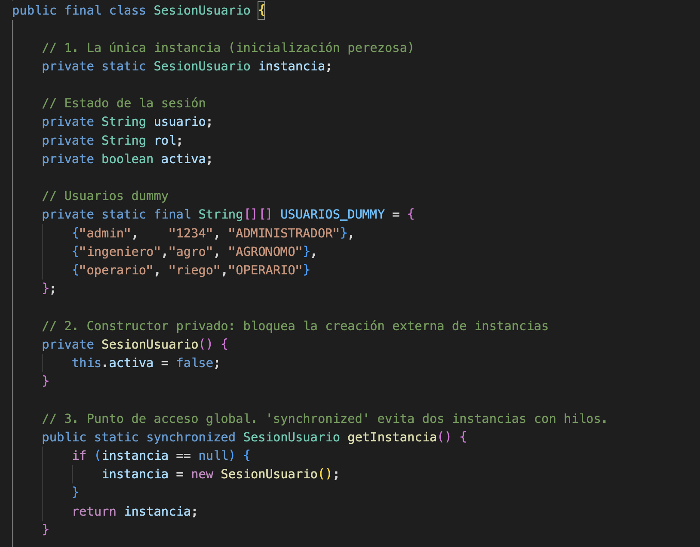
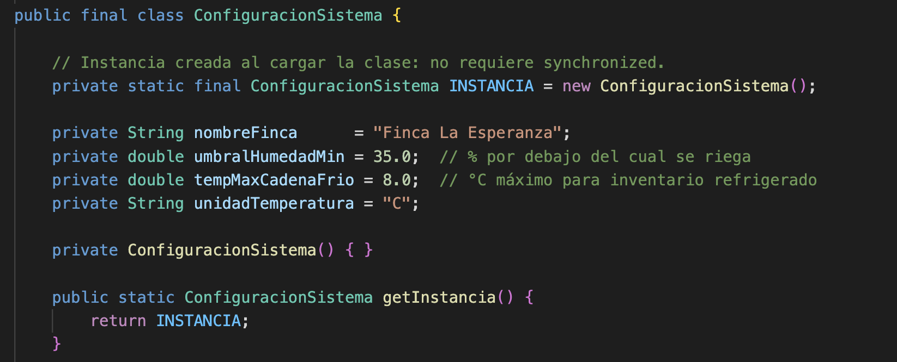
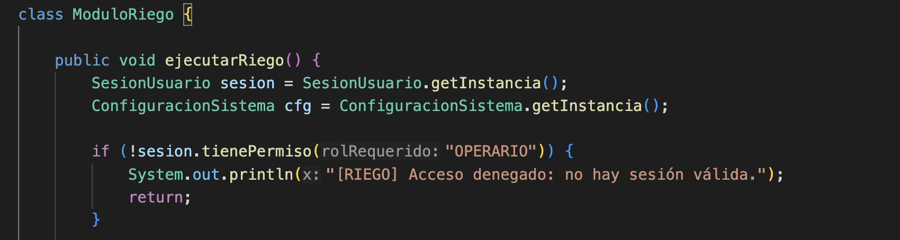
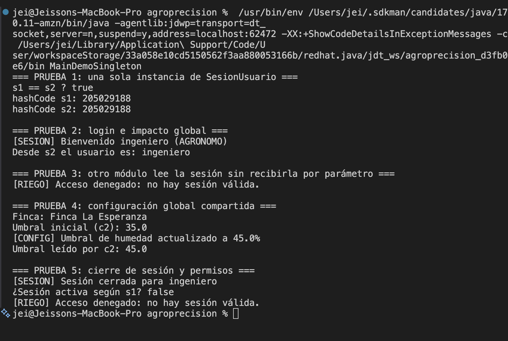
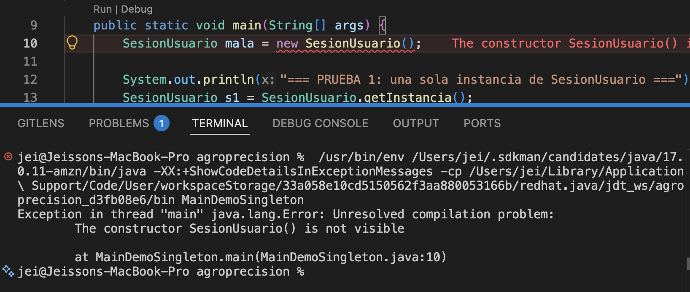
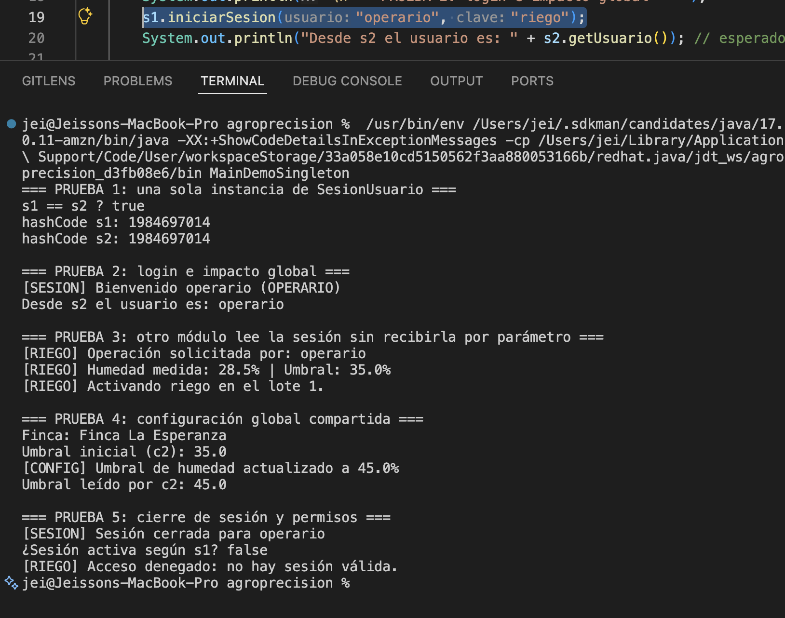

# Entrega 3 — Patrón Singleton

Aplicación del patrón **Singleton** en el módulo de sesión y configuración del prototipo
**AgroPrecisión**. Garantiza que exista una sola sesión de usuario y una sola configuración de
finca en toda la aplicación, con un punto de acceso global para los demás módulos.

**Código:** [`SesionUsuario.java`](src/SesionUsuario.java) (variante *lazy*) ·
[`ConfiguracionSistema.java`](src/ConfiguracionSistema.java) (variante *eager*) ·
[`MainDemoSingleton.java`](src/MainDemoSingleton.java) (demo)

**Para ejecutar:**

```bash
cd entrega-03-singleton/src && javac *.java && java MainDemoSingleton
```

La explicación del patrón está en el [README del proyecto](../README.md#-entregables).

---

## El problema

El sistema opera con un único usuario autenticado a la vez y con una única configuración de
finca. Los módulos de riego, inventario y reportes necesitan consultar ambas cosas: quién está
operando, con qué rol, y cuáles son los umbrales vigentes.

Si cada módulo creara su propio objeto de sesión aparecerían dos problemas. El primero es de
consistencia: el módulo de riego podría creer que hay un usuario conectado cuando ya cerró
sesión. El segundo es de propagación: si el administrador cambia el umbral de humedad, los demás
módulos seguirían usando el valor viejo. La alternativa sin patrón sería pasar esos objetos por
parámetro a todas las clases, lo que ensucia las firmas de todos los métodos del sistema.

## La solución

Aplicamos Singleton en dos clases, cada una con una variante distinta del patrón:

| Clase | Variante | Por qué |
|---|---|---|
| `SesionUsuario` | *Lazy*, con `synchronized` | La instancia se crea la primera vez que se pide |
| `ConfiguracionSistema` | *Eager*, con `static final` | Siempre se va a usar, y la JVM garantiza la inicialización |

Los tres elementos del patrón, en [`SesionUsuario.java`](src/SesionUsuario.java):

```java
public final class SesionUsuario {

    // 1. Atributo estático privado: la única instancia
    private static SesionUsuario instancia;

    // 2. Constructor privado: nadie puede hacer "new SesionUsuario()"
    private SesionUsuario() {
        this.activa = false;
    }

    // 3. Punto de acceso global. 'synchronized' evita dos instancias con hilos.
    public static synchronized SesionUsuario getInstancia() {
        if (instancia == null) {
            instancia = new SesionUsuario();
        }
        return instancia;
    }
}
```

El módulo cliente no recibe la sesión por parámetro, la obtiene del punto de acceso global
(ver `ModuloRiego` en [`MainDemoSingleton.java`](src/MainDemoSingleton.java)):

```java
public void ejecutarRiego() {
    SesionUsuario sesion = SesionUsuario.getInstancia();
    ConfiguracionSistema cfg = ConfiguracionSistema.getInstancia();
    ...
}
```

**Ventajas:** instancia única garantizada, acceso global sin propagar parámetros, estado
consistente entre módulos.
**Desventajas:** introduce estado global, dificulta las pruebas unitarias porque el estado
persiste entre ellas, y puede ocultar dependencias. Por eso lo limitamos a sesión y
configuración, y no a los módulos de negocio.

## Evidencias


Estas son las pruebas que ejecutamos sobre el prototipo AgroPrecisión para comprobar que el
patrón Singleton funciona como esperábamos en el módulo de sesión y configuración. Las tres
primeras capturas corresponden al código y las tres últimas a las ejecuciones.

Todo se ejecutó en VS Code sobre Java 17, con el botón *Run* de la extensión de Java.

| Captura | Qué muestra |
|---|---|
| [1](#captura-1) | Los tres elementos del patrón en `SesionUsuario` |
| [2](#captura-2) | La variante *eager* en `ConfiguracionSistema` |
| [3](#captura-3) | El módulo de riego obteniendo la sesión sin recibirla |
| [4](#captura-4) | La ejecución completa de las cinco pruebas |
| [5](#captura-5) | El intento de crear una segunda instancia |
| [6](#captura-6) | El riego activándose con un usuario con permiso |

---

<a id="captura-1"></a>
### Captura 1 — Los tres elementos del patrón



Esta es la clase `SesionUsuario`, y en ella se ven los tres elementos que forman el Singleton.

Primero, el atributo `private static SesionUsuario instancia`, que es donde vive la única
instancia de la clase. Es estático porque pertenece a la clase y no a los objetos, y es privado
para que ningún otro código pueda reemplazarlo.

Segundo, el constructor `private SesionUsuario()`. Al ser privado, ninguna otra clase puede
ejecutar `new SesionUsuario()`. Esto es lo que realmente impone el patrón, y lo comprobamos en
la captura 5.

Y tercero, el método `getInstancia()`, que es el punto de acceso global. La primera vez que se
llama, `instancia` todavía es `null` y el método crea el objeto; en las llamadas siguientes
simplemente devuelve el que ya existe. Esa es la inicialización perezosa. Lo declaramos
`synchronized` para que dos hilos no puedan entrar al mismo tiempo y terminar creando dos
instancias distintas.

<a id="captura-2"></a>
### Captura 2 — La variante *eager* en la configuración



`ConfiguracionSistema` también es un Singleton, pero construido de otra forma. Aquí la instancia
se crea directamente en la declaración, con `private static final`, así que existe desde que la
JVM carga la clase. Esa es la variante *eager*.

La ventaja es que no necesita `synchronized`: como la JVM garantiza que la inicialización de un
campo estático ocurre una sola vez, el problema de los hilos desaparece. Elegimos esta variante
porque la configuración de la finca siempre se va a usar, así que no tiene sentido retrasar su
creación.

Comparada con la captura 1, esta imagen sirve para mostrar que el patrón no es una receta única:
la estrategia de creación se elige según cómo se vaya a usar la clase.

<a id="captura-3"></a>
### Captura 3 — El módulo de riego no recibe la sesión



Aquí está el `ModuloRiego`, que es uno de los módulos que consumen los Singleton. Lo importante
de esta captura es la firma del método: `public void ejecutarRiego()` no recibe ningún parámetro.

Aun así, dentro del método consigue tanto la sesión como la configuración, llamando a
`getInstancia()` en cada una. Eso es el punto de acceso global funcionando: el módulo no depende
de que alguien le pase esos objetos.

Esta es justamente la ventaja que buscábamos. Sin el patrón habríamos tenido que agregar la
sesión y la configuración como parámetros en las firmas de todos los métodos del sistema, o
pasarlas por constructor a cada módulo.

<a id="captura-4"></a>
### Captura 4 — La ejecución completa



Esta es la salida de `MainDemoSingleton`, que recorre las cinco pruebas de la demo.

En la **prueba 1** pedimos la instancia dos veces y las comparamos con `==`, que en Java compara
referencias y no contenido. El resultado es `true`, y los dos `hashCode` son idénticos
(`205029188`), así que es literalmente el mismo objeto en memoria. Ese número cambia en cada
ejecución; lo que importa es que los dos sean iguales.

En la **prueba 2** hicimos login usando la referencia `s1` y luego leímos el usuario desde `s2`.
Aparece `ingeniero`, lo que confirma que el estado es compartido.

La **prueba 3** imprime `Acceso denegado`, y conviene aclararlo porque parece un fallo pero no lo
es. El usuario `ingeniero` tiene rol `AGRONOMO` y el módulo de riego exige `OPERARIO`, así que el
permiso se niega correctamente. Lo dejamos así a propósito, porque demuestra que el control de
permisos también viaja dentro del Singleton. El caso contrario está en la captura 6.

En la **prueba 4** cambiamos el umbral de humedad usando `c1` y lo leímos con `c2`: pasa de 35.0
a 45.0. Una sola fuente de verdad para la configuración.

Y en la **prueba 5** cerramos sesión desde `s2` y consultamos `s1`, que ya responde `false`. El
módulo de riego lo detecta de inmediato y vuelve a denegar el acceso, sin que nadie tuviera que
avisarle.

<a id="captura-5"></a>
### Captura 5 — El intento de crear una segunda instancia



Esta es la prueba más importante de la entrega. Agregamos a propósito, en la línea 10 de
`MainDemoSingleton.java`, la instrucción `SesionUsuario mala = new SesionUsuario();` para
intentar romper el patrón.

El resultado es que el proyecto no compila. En la captura se ve el subrayado rojo en el editor,
el contador de *Problems* en 1, y el mensaje del compilador:

```
The constructor SesionUsuario() is not visible
```

Esto es lo que queríamos demostrar: la unicidad de la instancia no depende de que nosotros nos
acordemos de no usar `new`. La impone el compilador, y por eso el patrón no se puede saltar por
descuido.

> Vale la pena aclarar la redacción del mensaje: VS Code compila con el compilador de Eclipse
> (JDT), que lo escribe como *"is not visible"*. Si se compila desde la terminal con `javac`, el
> mismo error aparece como `SesionUsuario() has private access in SesionUsuario`. Es el mismo
> problema, solo cambia la herramienta que lo reporta.

Después de tomar la captura eliminamos esa línea, así que el código entregado compila sin errores.

<a id="captura-6"></a>
### Captura 6 — El riego activándose



Para cerrar el caso que quedó abierto en la prueba 3, cambiamos el login de la línea 19 a
`s1.iniciarSesion("operario", "riego")`, un usuario que sí tiene el rol requerido.

Con ese cambio, el módulo de riego ya no deniega el acceso: identifica al operario, lee el umbral
de la configuración (35.0%), lo compara con la humedad medida (28.5%) y, como está por debajo,
activa el riego en el lote 1.

Lo interesante es que en esas tres líneas de salida el módulo está usando **los dos** Singleton a
la vez: la sesión para saber quién opera y con qué permiso, y la configuración para saber el
umbral. Ninguno de los dos se le pasó por parámetro.

También se ve que el `hashCode` de esta ejecución (`1984697014`) es distinto al de la captura 4,
lo cual es normal: cambia entre ejecuciones. Dentro de una misma ejecución sigue siendo el mismo
para `s1` y `s2`.

---

## Resultados

| # | Prueba | Resultado esperado | Resultado obtenido | Estado | Captura |
|---|---|---|---|---|---|
| 1 | Instancia única | `true` y hashCodes idénticos | `true`, ambos `205029188` | ✅ OK | 4 |
| 2 | Estado global | `s2.getUsuario()` devuelve `ingeniero` | `Desde s2 el usuario es: ingeniero` | ✅ OK | 4 |
| 3 | Acceso desde otro módulo | El módulo obtiene la sesión sin recibirla | Ejecuta y evalúa el permiso sin parámetros | ✅ OK | 3, 4, 6 |
| 4 | Configuración compartida | `c2` devuelve `45.0` | `Umbral leído por c2: 45.0` | ✅ OK | 4 |
| 5 | Cierre de sesión | `false` y acceso denegado | `false` y `[RIEGO] Acceso denegado` | ✅ OK | 4 |
| 6 | Constructor bloqueado | El proyecto no compila | `The constructor SesionUsuario() is not visible` | ✅ OK | 5 |
