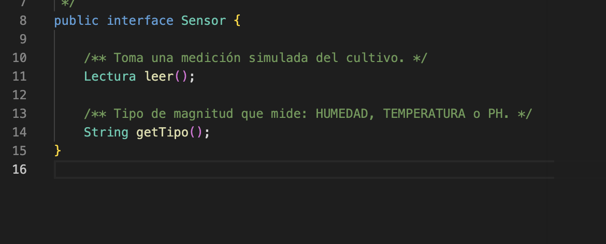
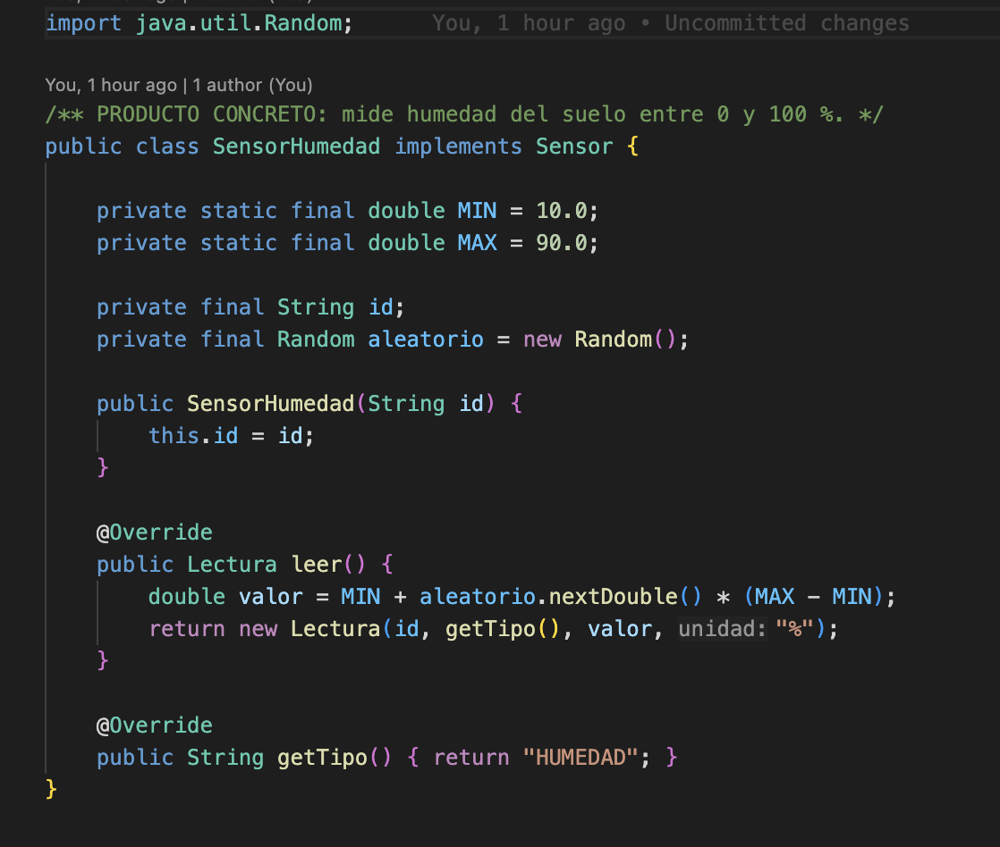
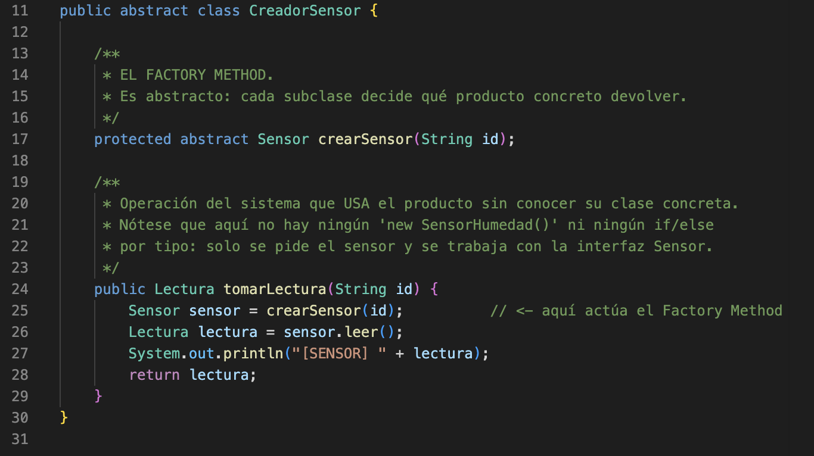
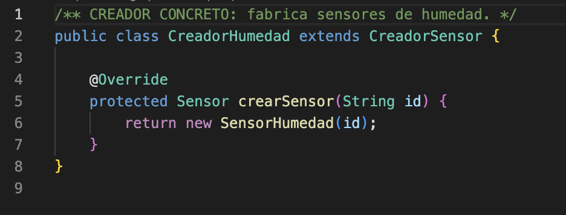
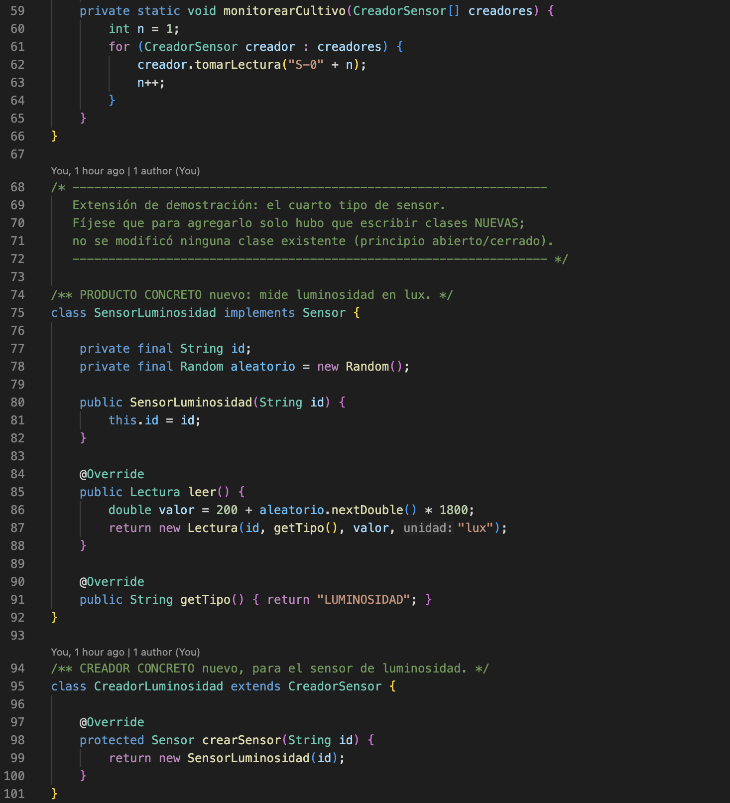
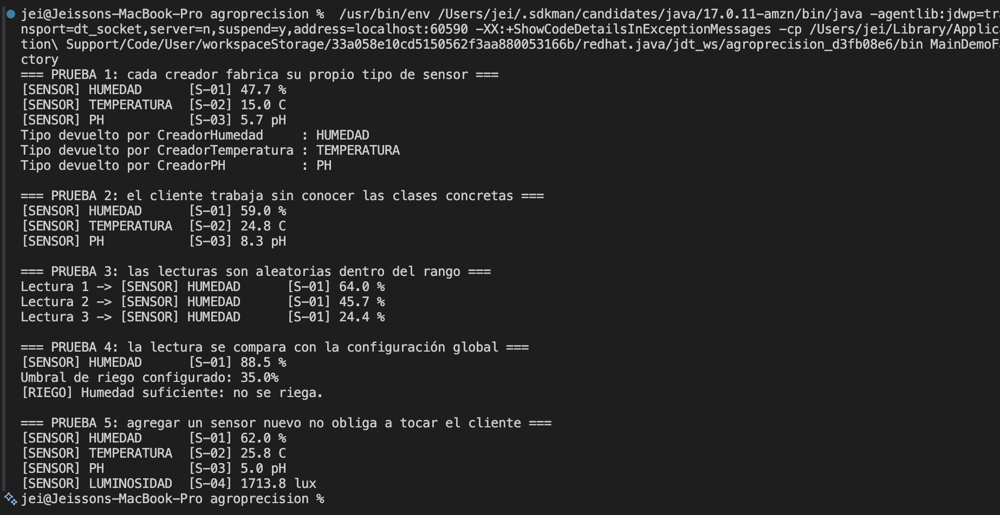

# Entrega 4 — Patrón Factory Method

**Proyecto:** AgroPrecisión — Sistema de Agricultura de Precisión
**Asignatura:** Patrones de Software
**Autores:** Darwin Felipe Gil López · Jeisson Stewen Berdugo Cely

Este documento recoge el avance acumulado del proyecto: la **Entrega 3**, donde aplicamos el
patrón Singleton en el módulo de sesión y configuración, y la **Entrega 4**, donde aplicamos el
patrón Factory Method en el módulo de sensores. Cada parte incluye el problema que resolvimos, el
código donde se evidencia el patrón y las pruebas ejecutadas con sus capturas.

## Contenido

- [El proyecto](#el-proyecto)
- [Cómo ejecutar](#cómo-ejecutar)
- [Parte 1 — Entrega 3: Patrón Singleton](#parte-1--entrega-3-patrón-singleton)
- [Parte 2 — Entrega 4: Patrón Factory Method](#parte-2--entrega-4-patrón-factory-method)

---

## El proyecto

AgroPrecisión es un prototipo de consola, escrito en Java puro y con datos simulados, que
representa un sistema de agricultura de precisión: monitoreo de cultivos con sensores, riego
automatizado, inventario con cadena de frío y predicción de cosechas. No busca ser un producto
terminado, sino un terreno donde aplicar un patrón de diseño distinto en cada entrega.

El diseño completo, con los objetivos y la hoja de ruta de patrones, está en
[`docs/01-objetivos-y-diseno.md`](../docs/01-objetivos-y-diseno.md).

## Cómo ejecutar

Cada entrega es independiente y se compila dentro de su propia carpeta. Se requiere JDK 17 o
superior; el código no usa paquetes.

```bash
cd entrega-03-singleton/src && javac *.java && java MainDemoSingleton
```

```bash
cd entrega-04-factory-method/src && javac *.java && java MainDemoFactory
```

En esta carpeta encontrará copias de `SesionUsuario.java` y `ConfiguracionSistema.java`, las dos
clases de la Entrega 3. Están aquí para que la Entrega 4 compile de forma independiente, y la
prueba 4 de la demo las utiliza para mostrar que los dos patrones conviven en el mismo flujo.

---

# Parte 1 — Entrega 3: Patrón Singleton

## El problema

El sistema opera con un único usuario autenticado a la vez y con una única configuración de
finca. Los módulos de riego, inventario y reportes necesitan consultar ambas cosas: quién está
operando, con qué rol, y cuáles son los umbrales vigentes.

Si cada módulo creara su propio objeto de sesión, aparecerían dos problemas. El primero es de
consistencia: el módulo de riego podría creer que hay un usuario conectado cuando ya cerró
sesión. El segundo es de propagación: si el administrador cambia el umbral de humedad, los demás
módulos seguirían usando el valor viejo. La alternativa sin patrón sería pasar esos objetos por
parámetro a todas las clases, lo que ensucia las firmas de todos los métodos del sistema.

## La solución

Aplicamos Singleton en dos clases, cada una con una variante distinta del patrón:

| Clase | Variante | Por qué |
|---|---|---|
| `SesionUsuario` | *Lazy*, con `synchronized` | La instancia se crea la primera vez que se pide |
| `ConfiguracionSistema` | *Eager*, con `static final` | Siempre se va a usar, y la JVM garantiza la inicialización |

Los tres elementos del patrón son el atributo estático privado que guarda la instancia, el
constructor privado que impide crear objetos desde fuera, y el método estático `getInstancia()`
que sirve de punto de acceso global.

## Evidencias de la Entrega 3

### Captura 1 — Los tres elementos del patrón


En `SesionUsuario` se ve el atributo `private static SesionUsuario instancia`, donde vive la
única instancia; el constructor `private SesionUsuario()`, que impide que otra clase ejecute
`new`; y el método `getInstancia()`, que crea el objeto la primera vez y después devuelve
siempre el mismo. Es `synchronized` para que dos hilos no puedan crear dos instancias distintas.

### Captura 2 — La variante *eager*


`ConfiguracionSistema` construye su instancia en la propia declaración, con
`private static final`, así que existe desde que la JVM carga la clase. No necesita
`synchronized`, porque la inicialización de un campo estático ocurre una sola vez por garantía
del lenguaje.

### Captura 3 — El cliente no recibe la sesión


La firma `public void ejecutarRiego()` no recibe ningún parámetro y aun así obtiene la sesión y
la configuración llamando a `getInstancia()`. Ese es el punto de acceso global funcionando.

### Captura 4 — Ejecución de las cinco pruebas


Pedir la instancia dos veces devuelve `true` al compararlas con `==`, y los `hashCode` coinciden.
El login hecho con `s1` se lee desde `s2`. El cambio de umbral hecho con `c1` lo ve `c2`. Y al
cerrar sesión desde `s2`, `s1` queda inactiva y el módulo de riego lo detecta de inmediato.

El `Acceso denegado` de la prueba 3 es intencional: el usuario `ingeniero` tiene rol `AGRONOMO` y
el riego exige `OPERARIO`, lo que demuestra que el permiso también viaja dentro del Singleton.

### Captura 5 — El constructor bloqueado


Al intentar `new SesionUsuario()` el proyecto no compila:
`The constructor SesionUsuario() is not visible`. Es la evidencia más contundente de la entrega,
porque demuestra que la unicidad la impone el compilador y no una convención entre programadores.

### Captura 6 — El riego activándose


Con el usuario `operario`, que sí tiene el rol requerido, el módulo lee la sesión y la
configuración, compara la humedad medida (28.5 %) contra el umbral (35.0 %) y activa el riego.

## Resultados de la Entrega 3

| # | Prueba | Resultado esperado | Resultado obtenido | Estado |
|---|---|---|---|---|
| 1 | Instancia única | `true` y hashCodes idénticos | `true`, ambos `205029188` | ✅ OK |
| 2 | Estado global | `s2` devuelve `ingeniero` | `Desde s2 el usuario es: ingeniero` | ✅ OK |
| 3 | Acceso desde otro módulo | Obtiene la sesión sin recibirla | Evalúa el permiso sin parámetros | ✅ OK |
| 4 | Configuración compartida | `c2` devuelve `45.0` | `Umbral leído por c2: 45.0` | ✅ OK |
| 5 | Cierre de sesión | `false` y acceso denegado | `false` y `[RIEGO] Acceso denegado` | ✅ OK |
| 6 | Constructor bloqueado | El proyecto no compila | `The constructor SesionUsuario() is not visible` | ✅ OK |

---

# Parte 2 — Entrega 4: Patrón Factory Method

## El problema

El módulo de sensores simula los drones e IoT que recorren el cultivo, y maneja tres tipos de
medición: humedad, temperatura y pH. Los tres entregan lo mismo —una lectura— pero se construyen
distinto, porque cada uno tiene su rango, su unidad y su escala.

El problema aparece al crearlos. Sin patrón, cada módulo que necesite una medición tendría que
decidir por su cuenta qué clase instanciar:

```java
if (tipo.equals("HUMEDAD"))    sensor = new SensorHumedad(id);
else if (tipo.equals("TEMP"))  sensor = new SensorTemperatura(id);
else if (tipo.equals("PH"))    sensor = new SensorPH(id);
```

Ese bloque no se queda en un solo lugar: se repetiría en riego, en reportes y en predicción. El
día que agreguemos un sensor de luminosidad habría que buscar y modificar los tres, lo que viola
el principio abierto/cerrado.

## Qué es el Factory Method

Es un patrón creacional. Su intención, según el GoF, es definir una interfaz para crear un objeto
pero dejar que las subclases decidan qué clase instanciar. Tiene cuatro roles: el producto, los
productos concretos, el creador que declara el método de fabricación, y los creadores concretos
que lo implementan.

## Cómo lo aplicamos

| Rol en el patrón | Clases |
|---|---|
| Producto | [`Sensor.java`](src/Sensor.java) (interfaz) · [`Lectura.java`](src/Lectura.java) (el dato medido) |
| Productos concretos | [`SensorHumedad.java`](src/SensorHumedad.java) · [`SensorTemperatura.java`](src/SensorTemperatura.java) · [`SensorPH.java`](src/SensorPH.java) |
| Creador | [`CreadorSensor.java`](src/CreadorSensor.java) — contiene el *factory method* |
| Creadores concretos | [`CreadorHumedad.java`](src/CreadorHumedad.java) · [`CreadorTemperatura.java`](src/CreadorTemperatura.java) · [`CreadorPH.java`](src/CreadorPH.java) |
| Demo | [`MainDemoFactory.java`](src/MainDemoFactory.java) |

El reparto del trabajo es lo importante. `CreadorSensor` tiene dos métodos: `crearSensor()`, que
es abstracto —ese es el factory method—, y `tomarLectura()`, que es la operación real del
sistema. Esa operación se escribió una sola vez y sirve para cualquier sensor, porque no depende
de ninguna clase concreta. Cada creador concreto aporta una sola línea: qué objeto devolver.

Vale la pena aclarar una decisión de diseño: no lo implementamos como una única clase
`SensorFactory` con un `switch`. Eso se conoce como *Simple Factory* y no forma parte del
catálogo GoF. El Factory Method exige la jerarquía de creadores que se ve arriba.

Los rangos de simulación de cada sensor son: humedad de 10 a 90 %, temperatura de 5 a 38 °C, pH
de 4.5 a 8.5 y luminosidad de 200 a 2000 lux. El valor se genera aleatoriamente dentro del rango
en cada lectura.

## Evidencias de la Entrega 4

### Captura 7 — La interfaz `Sensor`



**Archivo:** `src/Sensor.java` · **Líneas:** 8 a 15

Es el contrato que comparten los tres sensores: `leer()`, que devuelve una `Lectura`, y
`getTipo()`. El código cliente trabaja siempre contra esta interfaz, nunca contra las clases
concretas. En el patrón, este es el rol de **producto**.

### Captura 8 — Un producto concreto



**Archivo:** `src/SensorHumedad.java` (archivo completo)

`SensorHumedad` implementa la interfaz y define su propio rango, de 10 a 90 %. El método `leer()`
genera un valor aleatorio dentro de ese rango y lo empaqueta en una `Lectura` con su unidad. Los
otros dos sensores son iguales en estructura y solo cambian rango y unidad.

### Captura 9 — El factory method



**Archivo:** `src/CreadorSensor.java` · **Líneas:** 11 a 30

Esta es la captura central de la entrega. En la línea 17, `crearSensor()` está declarado
`abstract`: la clase creadora no decide qué sensor construir, delega esa decisión en sus
subclases. Ese método es el **factory method**.

Debajo, `tomarLectura()` es la operación que usa el producto. Fíjese en lo que **no** hay en ese
método: ni un `new SensorHumedad()`, ni un `if` por tipo. Solo pide el sensor y trabaja con la
interfaz. Por eso este código se escribe una vez y no vuelve a tocarse.

### Captura 10 — Un creador concreto



**Archivo:** `src/CreadorHumedad.java` · **Líneas:** 1 a 8 (archivo completo)

Todo el aporte de un creador concreto cabe en una línea: devolver el producto que le corresponde.
`CreadorTemperatura` y `CreadorPH` son idénticos salvo por la clase que instancian.

### Captura 11 — El cliente y la extensión



**Archivo:** `src/MainDemoFactory.java` · **Líneas:** 59 a 101

Arriba está `monitorearCultivo()`, el código cliente: recibe un arreglo del tipo abstracto
`CreadorSensor` y los recorre a todos igual, sin distinguir tipos.

Abajo están `SensorLuminosidad` y `CreadorLuminosidad`, un cuarto tipo de sensor que no existía
cuando se escribió ese método. Para agregarlo solo hubo que escribir clases **nuevas**: no se
modificó ninguna clase existente. Eso es el principio abierto/cerrado, y es el mejor argumento a
favor del patrón.

### Captura 12 — Ejecución de las cinco pruebas



Salida de `MainDemoFactory` con las cinco pruebas.

La prueba 1 confirma que cada creador devuelve su tipo con su unidad: `HUMEDAD` en `%`,
`TEMPERATURA` en `C` y `PH` en la escala de pH. La prueba 2 recorre los tres desde un mismo
bucle, sin distinguirlos. La prueba 3 toma tres lecturas seguidas del sensor de humedad y
devuelve 64.0 %, 45.7 % y 24.4 %: valores distintos, todos dentro del rango de 10 a 90 %.

La prueba 4 enlaza con la Entrega 3: la lectura de 88.5 % se compara contra el umbral de 35.0 %
que entrega `ConfiguracionSistema.getInstancia()`, y como está por encima decide no regar. Ahí se
ve a los dos patrones trabajando en el mismo flujo.

La prueba 5 es la más importante. Se agrega el sensor de luminosidad al arreglo y aparece la
cuarta lectura, `1713.8 lux`, sin que `monitorearCultivo()` haya cambiado ni una línea.

## Índice de capturas

| Archivo | Qué muestra | Líneas |
|---|---|---|
| `evidencias/captura_7.png` | `src/Sensor.java` — la interfaz producto | 8–15 |
| `evidencias/captura_8.png` | `src/SensorHumedad.java` — producto concreto | completo |
| `evidencias/captura_9.png` | `src/CreadorSensor.java` — **el factory method** | 11–30 |
| `evidencias/captura_10.png` | `src/CreadorHumedad.java` — creador concreto | 1–8 |
| `evidencias/captura_11.png` | `src/MainDemoFactory.java` — cliente y extensión | 59–101 |
| `evidencias/captura_12.png` | Terminal con la ejecución completa | — |

Las capturas 1 a 6 corresponden a la Entrega 3 y están en
[`entrega-03-singleton/evidencias/`](../entrega-03-singleton/evidencias/).

## Resultados de la Entrega 4

| # | Prueba | Resultado esperado | Resultado obtenido | Estado | Captura |
|---|---|---|---|---|---|
| 1 | Cada creador fabrica su producto | Tipos `HUMEDAD`, `TEMPERATURA` y `PH` con sus unidades | `47.7 %`, `15.0 C`, `5.7 pH`, cada tipo con su unidad | ✅ OK | 12 |
| 2 | Cliente sin clases concretas | Las tres lecturas salen de un mismo bucle | Las tres se imprimen desde `monitorearCultivo()` | ✅ OK | 11, 12 |
| 3 | Lecturas aleatorias | Tres valores distintos entre 10 y 90 % | `64.0 %`, `45.7 %` y `24.4 %` | ✅ OK | 12 |
| 4 | Integración con la Entrega 3 | Umbral 35.0 % y decisión de riego | Lectura `88.5 %` contra umbral `35.0 %`: no riega | ✅ OK | 12 |
| 5 | Extensibilidad | Cuarta lectura en `lux` sin tocar el cliente | `LUMINOSIDAD [S-04] 1713.8 lux` | ✅ OK | 11, 12 |
