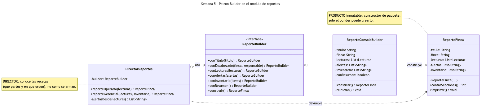
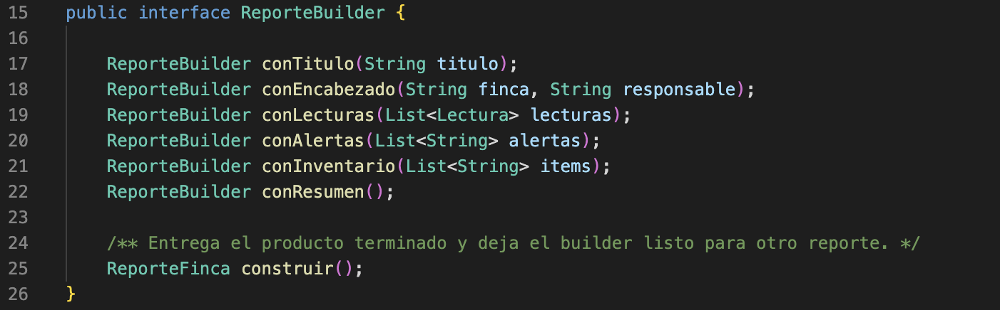
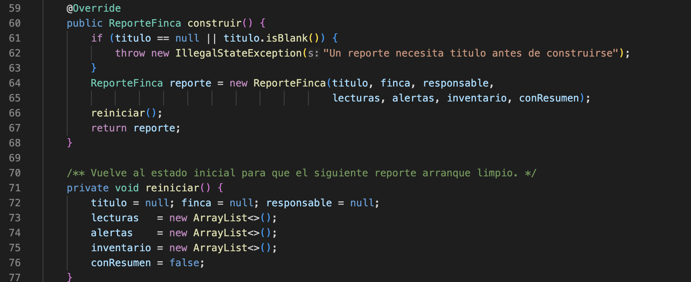
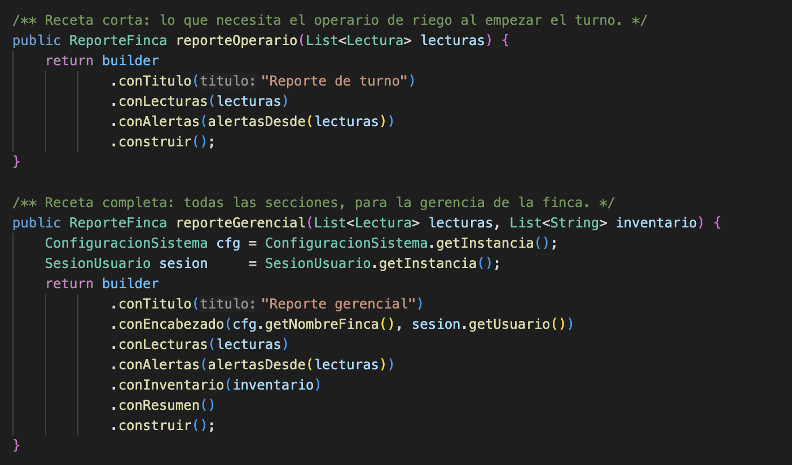
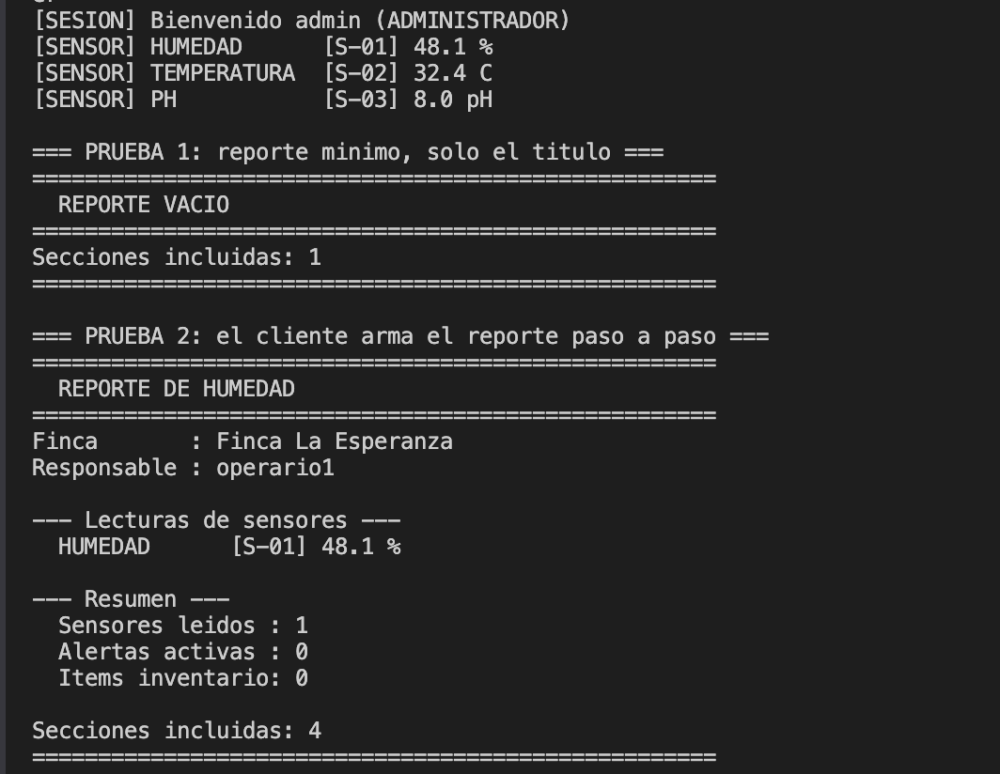
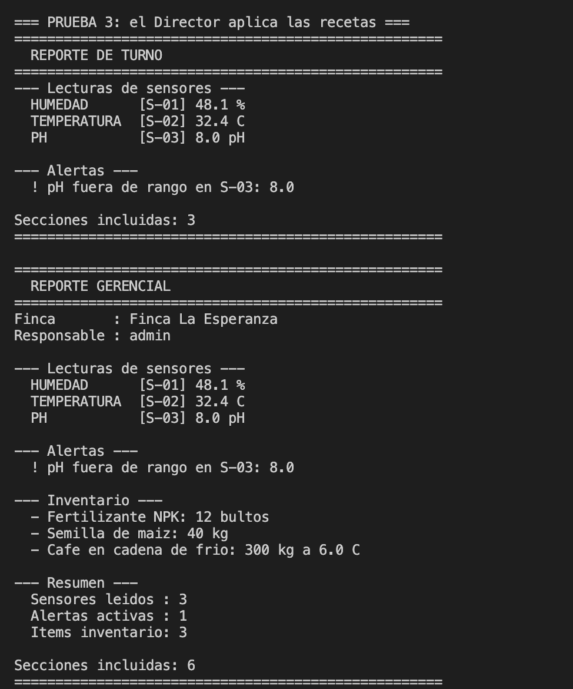
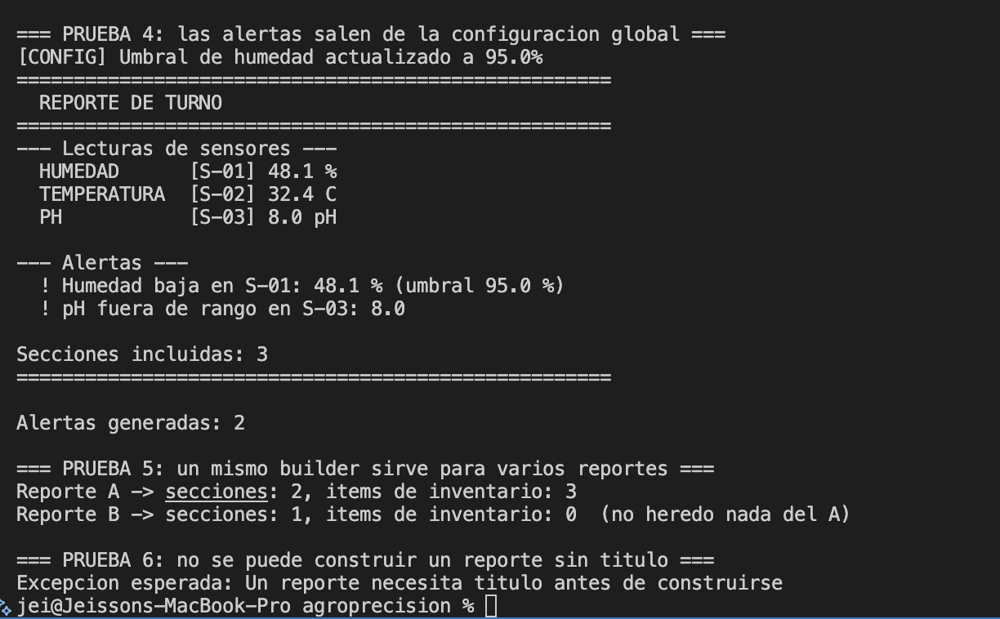

# Semana 5 — Patrón Builder

Aplicación del patrón **Builder** en el módulo de reportes del prototipo **AgroPrecisión**.
Permite armar un reporte de estado de la finca por partes —encabezado, lecturas, alertas,
inventario, resumen— y obtener reportes distintos (el de turno del operario, el gerencial) con el
mismo proceso de construcción, sin constructores con ocho parámetros ni banderas booleanas.

**Estudiantes:** Jeisson Stewen Berdugo Cely · Darwin Felipe Gil López
**Grupo:** E-195

**Código:** [`ReporteFinca.java`](src/ReporteFinca.java) (producto) ·
[`ReporteBuilder.java`](src/ReporteBuilder.java) (builder) ·
[`ReporteConsolaBuilder.java`](src/ReporteConsolaBuilder.java) (builder concreto) ·
[`DirectorReportes.java`](src/DirectorReportes.java) (director) ·
[`MainDemoBuilder.java`](src/MainDemoBuilder.java) (demo)

**Para ejecutar:**

```bash
cd semana-5-builder/src && javac *.java && java MainDemoBuilder
```

Las clases `SesionUsuario`, `ConfiguracionSistema`, `Lectura`, `Sensor`, los sensores y los
creadores están copiadas de las semanas 3 y 4 para que esta carpeta compile por sí sola. No se
modificó nada de su contenido.

---

## El problema

El módulo de reportes imprime por consola el estado de la finca. Pero no hay *un* reporte: el
operario de riego necesita al empezar el turno solo las lecturas y las alertas; la gerencia quiere
además el encabezado con el responsable, el inventario y un resumen con totales. Y mañana puede
aparecer otro con solo el inventario para el bodeguero.

Sin patrón, la clase `ReporteFinca` termina con un constructor así:

```java
new ReporteFinca("Reporte gerencial", "Finca La Esperanza", "admin",
                 lecturas, alertas, inventario, true);
```

Siete parámetros, la mitad opcionales, y para el reporte del operario habría que pasar `null`,
`null`, listas vacías y `false`. Es el *code smell* de **Long Parameter List** que analizamos en la
Semana 2, y con cada sección nueva el constructor crece. La alternativa de sobrecargar
constructores (el "constructor telescópico") multiplica combinaciones y no escala.

## Qué es el Builder

Es un patrón creacional. Su intención, según el GoF, es separar la construcción de un objeto
complejo de su representación, de modo que el mismo proceso de construcción pueda crear
representaciones diferentes. Tiene cuatro roles: el **producto**, el **builder** que declara los
pasos de construcción, el **builder concreto** que los implementa y guarda el estado parcial, y el
**director**, que conoce las recetas —qué pasos y en qué orden— para los productos habituales.

## Cómo lo aplicamos

| Rol en el patrón | Clases |
|---|---|
| Producto | [`ReporteFinca.java`](src/ReporteFinca.java) — inmutable, con secciones opcionales |
| Builder | [`ReporteBuilder.java`](src/ReporteBuilder.java) — interfaz con un método por sección y `construir()` |
| Builder concreto | [`ReporteConsolaBuilder.java`](src/ReporteConsolaBuilder.java) — acumula las partes, valida y crea el producto |
| Director | [`DirectorReportes.java`](src/DirectorReportes.java) — recetas `reporteOperario()` y `reporteGerencial()` |
| Demo | [`MainDemoBuilder.java`](src/MainDemoBuilder.java) |

Tres decisiones de diseño sostienen la implementación:

- **El producto solo se puede crear desde el builder.** El constructor de `ReporteFinca` no es
  `public` y sus campos son `final`. Un reporte nunca queda a medio armar: existe cuando está
  completo y después no cambia.
- **Cada método del builder devuelve `this`.** Así el cliente encadena solo las partes que quiere,
  en el orden que quiera: `conTitulo(...).conLecturas(...).construir()`. Lo que no se pide, no
  aparece.
- **`construir()` valida y reinicia.** Exige el título (lo único obligatorio) y, tras entregar el
  producto, deja el builder limpio. Un mismo builder arma varios reportes sin que uno herede las
  partes del anterior.

El `DirectorReportes` conecta esta semana con las dos anteriores: toma el nombre de la finca de
`ConfiguracionSistema` y el responsable de `SesionUsuario` (Semana 3), recibe las lecturas que
producen las fábricas de sensores (Semana 4) y deriva las alertas comparándolas con los umbrales
globales. El director solo habla con la interfaz `ReporteBuilder`: si mañana existiera un
`ReporteArchivoBuilder` que escriba el reporte a un `.txt`, las recetas no cambiarían.

---

## Diagrama UML



`DirectorReportes` solo conoce la interfaz `ReporteBuilder`, nunca al builder concreto ni al
producto que este arma. `ReporteConsolaBuilder` acumula las partes y es el único que construye
`ReporteFinca`, cuyo constructor es de paquete: por eso ningún otro objeto puede crear un reporte
a medio armar. La flecha punteada de `ReporteConsolaBuilder` a `ReporteFinca` es la creación del
producto en `construir()`.

Fuente del diagrama: [`diagramas/uml-builder.mmd`](diagramas/uml-builder.mmd).

## Evidencias

Estas son las pruebas que ejecutamos sobre el prototipo para comprobar que el patrón Builder
funciona como esperábamos en el módulo de reportes. Las tres primeras capturas corresponden al
código y las tres últimas a las ejecuciones. La numeración continúa la de las semanas anteriores.

Todo se ejecutó en VS Code sobre Java 17, con el botón *Run* de la extensión de Java.

| Captura | Qué muestra |
|---|---|
| [13](#captura-13) | La interfaz `ReporteBuilder` con los pasos de construcción |
| [14](#captura-14) | `construir()` en el builder concreto: validación, creación y reinicio |
| [15](#captura-15) | Las dos recetas del `DirectorReportes` |
| [16](#captura-16) | Pruebas 1 y 2: reporte mínimo y reporte armado paso a paso |
| [17](#captura-17) | Prueba 3: reporte de turno y reporte gerencial desde el director |
| [18](#captura-18) | Pruebas 4 a 6: alertas por configuración, reutilización y validación |

---

<a id="captura-13"></a>
### Captura 13 — La interfaz `ReporteBuilder`



**Archivo:** `src/ReporteBuilder.java` · **Líneas:** 15 a 26

Un método por sección del reporte y `construir()` al final. Todos devuelven `ReporteBuilder`, que
es lo que permite encadenar las llamadas. Que sea una interfaz —y no directamente la clase
concreta— es lo que deja al director y al cliente independientes de cómo se representa el reporte.

<a id="captura-14"></a>
### Captura 14 — `construir()` en el builder concreto



**Archivo:** `src/ReporteConsolaBuilder.java` · **Líneas:** 59 a 77

Tres cosas ocurren aquí: se valida que haya título (línea 61), se crea el producto de una sola vez
con todas sus partes (línea 64) y se llama a `reiniciar()` (línea 66) para que el builder quede
listo para el siguiente reporte. Es la única línea del proyecto que hace `new ReporteFinca(...)`.

<a id="captura-15"></a>
### Captura 15 — Las recetas del director



**Archivo:** `src/DirectorReportes.java` · **Líneas:** 24 a 44

`reporteOperario()` pide tres partes; `reporteGerencial()` pide las seis. El director no sabe cómo
se arma ninguna: solo dice cuáles y en qué orden. Se ve también la integración con las semanas
anteriores: `ConfiguracionSistema.getInstancia()` y `SesionUsuario.getInstancia()` aportan el
encabezado.

<a id="captura-16"></a>
### Captura 16 — Pruebas 1 y 2



**Terminal:** salida de `java MainDemoBuilder`, pruebas 1 y 2.

La prueba 1 construye un reporte con solo el título: una sección. La prueba 2 lo arma el cliente
a mano, eligiendo encabezado, una lectura y resumen: cuatro secciones. Ninguna de las dos pasó
`null` ni listas vacías; simplemente no llamó a los métodos de las partes que no quería.

<a id="captura-17"></a>
### Captura 17 — Prueba 3



**Terminal:** salida de `java MainDemoBuilder`, prueba 3.

El mismo builder produce dos reportes distintos según la receta del director: el de turno con tres
secciones y el gerencial con seis, incluyendo el encabezado con `Finca La Esperanza` y el usuario
`admin` de la sesión activa.

<a id="captura-18"></a>
### Captura 18 — Pruebas 4 a 6



**Terminal:** salida de `java MainDemoBuilder`, pruebas 4 a 6.

En la prueba 4 se sube el umbral de humedad a 95 % en la configuración global y el siguiente
reporte de turno incluye la alerta de humedad baja: las alertas no están quemadas en el reporte,
se derivan de la Semana 3. En la prueba 5, el reporte B tiene una sección y cero ítems de
inventario aunque el A, construido justo antes con el mismo builder, tenía inventario. En la
prueba 6, intentar construir sin título lanza `IllegalStateException`.

---

## Resultados

| # | Prueba | Resultado esperado | Resultado obtenido | Estado | Captura |
|---|---|---|---|---|---|
| 1 | Reporte mínimo | Solo título, `Secciones incluidas: 1` | `REPORTE VACIO`, 1 sección | ✅ OK | 16 |
| 2 | Construcción paso a paso | Encabezado, 1 lectura y resumen: 4 secciones | `Secciones incluidas: 4`, lectura `HUMEDAD [S-01] 48.1 %`, sin alertas ni inventario | ✅ OK | 16 |
| 3 | Recetas del director | Turno con 3 secciones; gerencial con 6 | `REPORTE DE TURNO` 3 · `REPORTE GERENCIAL` 6, responsable `admin`, alerta `pH fuera de rango en S-03: 8.0` | ✅ OK | 17 |
| 4 | Alertas desde la configuración | Al subir el umbral a 95 % aparece alerta de humedad | `Humedad baja en S-01: 48.1 % (umbral 95.0 %)`, `Alertas generadas: 2` | ✅ OK | 18 |
| 5 | Builder reutilizable | El reporte B no hereda partes del A | `A -> 2 secciones, 3 items` · `B -> 1 sección, 0 items` | ✅ OK | 18 |
| 6 | Validación | `IllegalStateException` sin título | `Un reporte necesita titulo antes de construirse` | ✅ OK | 18 |
