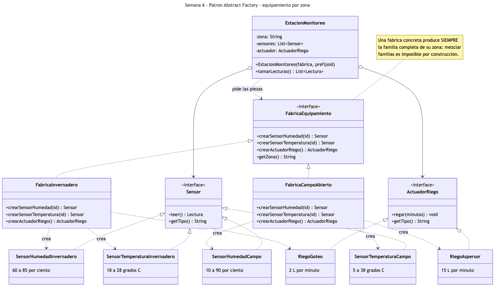
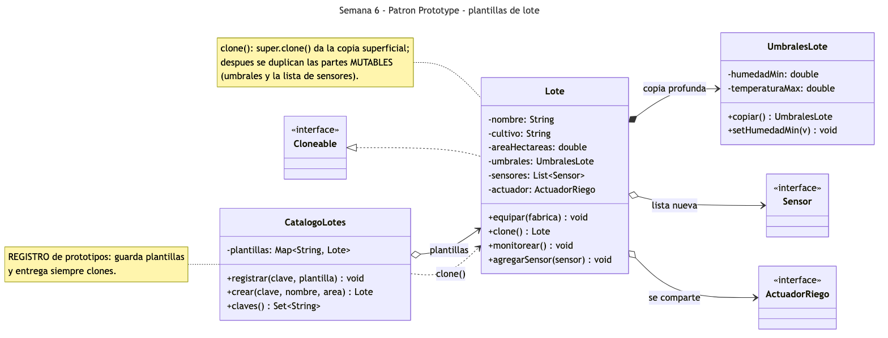
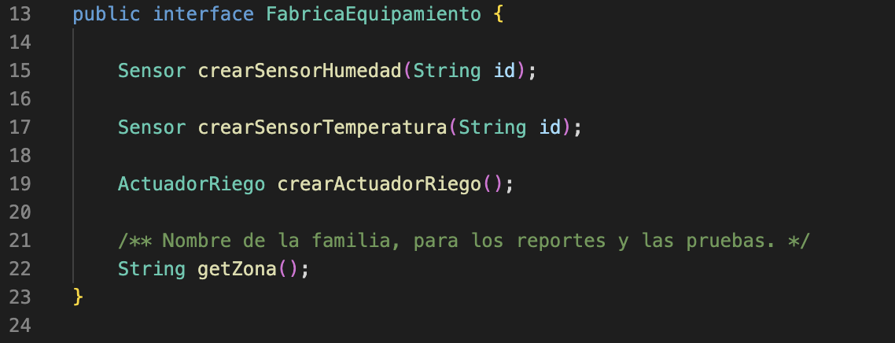
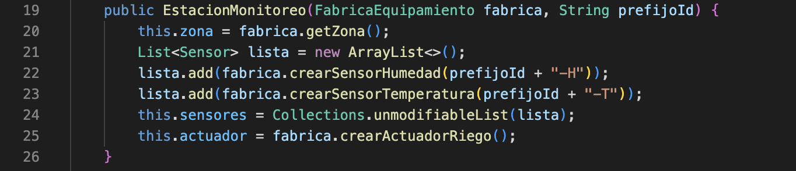
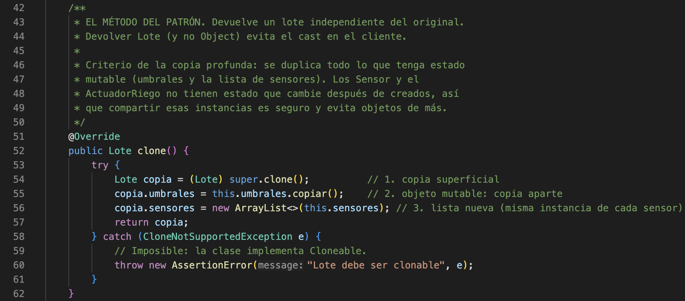
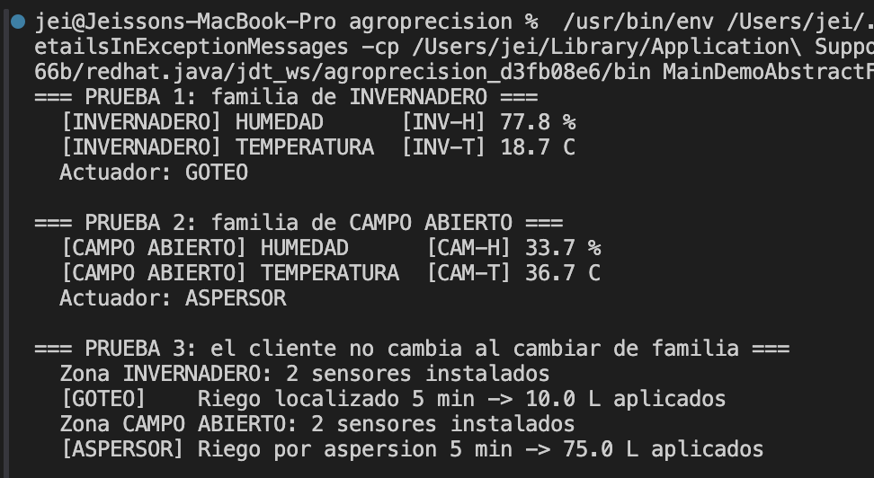
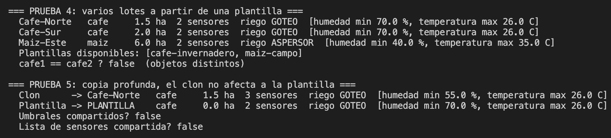
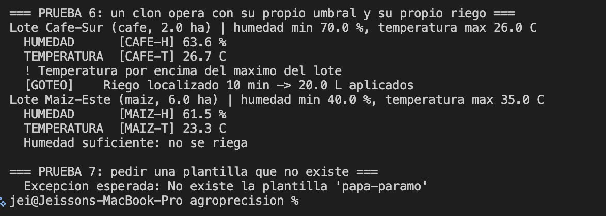

# Semana 6 — Patrones Abstract Factory y Prototype

Aplicación de dos patrones creacionales en el prototipo **AgroPrecisión**. **Abstract Factory**
produce familias completas de equipamiento coherentes con la zona de cultivo —invernadero o campo
abierto—; **Prototype** permite registrar un lote ya equipado como plantilla y crear los demás
lotes de la finca clonándolo, en vez de armar cada uno desde cero.

**Estudiantes:** Jeisson Stewen Berdugo Cely · Darwin Felipe Gil López
**Grupo:** E-195

**Código Abstract Factory:** [`FabricaEquipamiento.java`](src/FabricaEquipamiento.java) (fábrica abstracta) ·
[`FabricaInvernadero.java`](src/FabricaInvernadero.java) · [`FabricaCampoAbierto.java`](src/FabricaCampoAbierto.java) (fábricas concretas) ·
[`ActuadorRiego.java`](src/ActuadorRiego.java) (producto abstracto) · [`EstacionMonitoreo.java`](src/EstacionMonitoreo.java) (cliente)

**Código Prototype:** [`Lote.java`](src/Lote.java) (prototipo) · [`UmbralesLote.java`](src/UmbralesLote.java) (parte mutable) ·
[`CatalogoLotes.java`](src/CatalogoLotes.java) (registro de prototipos)

**Demo:** [`MainDemoAbstractFactoryPrototype.java`](src/MainDemoAbstractFactoryPrototype.java)

**Para ejecutar:**

```bash
cd semana-6-abstract-factory-prototype/src && javac *.java && java MainDemoAbstractFactoryPrototype
```

Las clases `Sensor` y `Lectura` están copiadas de la Semana 4 para que esta carpeta compile por sí
sola. No se modificó nada de su contenido.

---

## Parte 1 — Abstract Factory: equipamiento por zona

### El problema

La finca tiene dos tipos de zona. En el **invernadero** el ambiente es controlado: la humedad se
mueve entre 60 y 85 %, la temperatura entre 18 y 28 °C, y se riega por goteo. En **campo abierto**
los sensores enfrentan el clima real —10 a 90 %, 5 a 38 °C— y se riega por aspersión.

Cada zona necesita, entonces, un *conjunto* de dispositivos que deben ir juntos: sus dos sensores y
su actuador. El Factory Method de la Semana 4 resuelve la creación de *un* producto, pero no evita
la combinación incoherente: nada impide instalar un sensor de invernadero junto a un aspersor de
campo. Y si la selección se hiciera con `if (zona.equals("invernadero"))` en cada punto donde se
crea un dispositivo, el mismo bloque se repetiría tres veces por zona y habría que buscarlos todos
cuando aparezca la tercera zona (por ejemplo, un cultivo hidropónico).

### Qué es el Abstract Factory

Es un patrón creacional. Su intención, según el GoF, es proporcionar una interfaz para crear
familias de objetos relacionados o dependientes sin especificar sus clases concretas. Tiene cuatro
roles: la **fábrica abstracta**, que declara un método de creación por cada producto de la familia;
las **fábricas concretas**, una por familia; los **productos abstractos** y los **productos
concretos**; y el **cliente**, que solo usa las interfaces.

La diferencia con el Factory Method es de alcance: el Factory Method es *un método* que crea *un*
producto; el Abstract Factory es *un objeto* que crea *una familia completa*. De hecho, cada
método de la fábrica concreta es, internamente, un factory method.

### Cómo lo aplicamos

| Rol en el patrón | Clases |
|---|---|
| Fábrica abstracta | [`FabricaEquipamiento.java`](src/FabricaEquipamiento.java) — `crearSensorHumedad()`, `crearSensorTemperatura()`, `crearActuadorRiego()` |
| Fábricas concretas | [`FabricaInvernadero.java`](src/FabricaInvernadero.java) · [`FabricaCampoAbierto.java`](src/FabricaCampoAbierto.java) |
| Productos abstractos | `Sensor` (de la Semana 4) · [`ActuadorRiego.java`](src/ActuadorRiego.java) |
| Productos concretos, familia invernadero | [`SensorHumedadInvernadero.java`](src/SensorHumedadInvernadero.java) · [`SensorTemperaturaInvernadero.java`](src/SensorTemperaturaInvernadero.java) · [`RiegoGoteo.java`](src/RiegoGoteo.java) |
| Productos concretos, familia campo abierto | [`SensorHumedadCampo.java`](src/SensorHumedadCampo.java) · [`SensorTemperaturaCampo.java`](src/SensorTemperaturaCampo.java) · [`RiegoAspersor.java`](src/RiegoAspersor.java) |
| Cliente | [`EstacionMonitoreo.java`](src/EstacionMonitoreo.java) — recibe una fábrica y arma la estación |

Lo que garantiza la coherencia es el tipo: `EstacionMonitoreo` recibe *una* `FabricaEquipamiento`
y le pide todas las piezas a ella. Como `FabricaInvernadero` solo sabe fabricar productos de
invernadero, la mezcla es imposible por construcción. El cliente no contiene ningún `new` de clase
concreta ni ningún `if` por zona; cambiar de invernadero a campo abierto es cambiar el objeto
fábrica que se le pasa.

`ActuadorRiego` es el *dispositivo* que aplica el agua. La *decisión* de cuándo regar no está aquí:
esa lógica pertenece al módulo de riego y será el tema del patrón Strategy.

---

### Diagrama UML del Abstract Factory



La fábrica abstracta declara un método por producto y cada fábrica concreta crea, en exclusiva,
los productos de su familia: las flechas de creación de `FabricaInvernadero` apuntan solo a
`SensorHumedadInvernadero`, `SensorTemperaturaInvernadero` y `RiegoGoteo`. `EstacionMonitoreo`
depende únicamente de las tres interfaces —`FabricaEquipamiento`, `Sensor` y `ActuadorRiego`—, que
es lo que le permite funcionar igual con cualquier zona.

Fuente del diagrama: [`diagramas/uml-abstract-factory.mmd`](diagramas/uml-abstract-factory.mmd).

---

## Parte 2 — Prototype: plantillas de lote

### El problema

Una finca cafetera tiene decenas de lotes casi idénticos: mismo cultivo, mismos umbrales, mismo
equipamiento; solo cambian el nombre y el área. Armar cada lote desde cero significa repetir cada
vez la misma secuencia: crear los umbrales, elegir la fábrica, equipar. Si un día cambia la
plantilla —otro umbral de humedad, un sensor más—, hay que buscar todos los sitios donde se armó un
lote.

Además, `Lote` contiene objetos anidados mutables. Copiarlo "a mano" con `new Lote(...)` pasando
los mismos umbrales produce dos lotes que **comparten** el objeto de umbrales: cambiar el de uno
cambia el del otro. Es un error silencioso que solo aparece en producción.

### Qué es el Prototype

Es un patrón creacional. Su intención, según el GoF, es especificar los tipos de objetos a crear
usando una instancia prototípica, y crear nuevos objetos copiando ese prototipo. Sus roles son el
**prototipo** (declara la operación de clonado), los **prototipos concretos** (la implementan) y el
**cliente**, que crea objetos pidiéndole al prototipo que se clone. Es habitual acompañarlo de un
**registro** que guarda las plantillas bajo una clave.

El punto técnico del patrón es la diferencia entre **copia superficial** y **copia profunda**. La
superficial copia los campos tal cual: los primitivos quedan independientes, pero los objetos
anidados quedan compartidos. La profunda duplica también lo anidado que sea mutable.

### Cómo lo aplicamos

| Rol en el patrón | Clases |
|---|---|
| Prototipo | [`Lote.java`](src/Lote.java) — `implements Cloneable`, sobreescribe `clone()` |
| Parte mutable anidada | [`UmbralesLote.java`](src/UmbralesLote.java) — con su propio `copiar()` |
| Registro de prototipos | [`CatalogoLotes.java`](src/CatalogoLotes.java) — `registrar()` y `crear()` |
| Cliente | [`MainDemoAbstractFactoryPrototype.java`](src/MainDemoAbstractFactoryPrototype.java) |

`Lote.clone()` hace tres cosas: llama a `super.clone()` para obtener la copia superficial, copia
aparte los umbrales con `umbrales.copiar()`, y crea una lista nueva de sensores. El criterio es
explícito: **se duplica todo lo que tenga estado mutable**. `Sensor` y `ActuadorRiego` no tienen
estado que cambie después de creados, así que compartir esas instancias entre lotes es seguro y
evita objetos innecesarios. `clone()` devuelve `Lote` y no `Object` (tipo de retorno covariante)
para que el cliente no necesite hacer un *cast*.

`CatalogoLotes` guarda las plantillas en un `Map` y las entrega siempre clonadas con
`crear(clave, nombre, area)`. El cliente nunca toca la plantilla original.

Las dos partes de la semana se encuentran en `Lote.equipar(FabricaEquipamiento)`: la plantilla se
equipa **una sola vez** con la fábrica de su zona, y cada clon hereda el equipamiento completo.

---

### Diagrama UML del Prototype



El diagrama distingue con la notación lo que el código decide en `clone()`: la relación con
`UmbralesLote` es de **composición** (rombo lleno) porque cada lote tiene los suyos y se duplican
al clonar; las relaciones con `Sensor` y `ActuadorRiego` son de **agregación** (rombo vacío) porque
esas instancias se comparten entre el prototipo y sus clones. `CatalogoLotes` guarda las plantillas
y entrega siempre una copia.

Fuente del diagrama: [`diagramas/uml-prototype.mmd`](diagramas/uml-prototype.mmd).

## Evidencias

Estas son las pruebas que ejecutamos sobre el prototipo para comprobar que los dos patrones
funcionan como esperábamos. Las tres primeras capturas corresponden al código y las tres últimas a
las ejecuciones. La numeración continúa la de las semanas anteriores.

Todo se ejecutó en VS Code sobre Java 17, con el botón *Run* de la extensión de Java.

| Captura | Qué muestra |
|---|---|
| [19](#captura-19) | La fábrica abstracta `FabricaEquipamiento` |
| [20](#captura-20) | El cliente `EstacionMonitoreo` armando la estación sin clases concretas |
| [21](#captura-21) | `Lote.clone()` con la copia profunda |
| [22](#captura-22) | Pruebas 1 a 3: las dos familias y el cliente que no cambia |
| [23](#captura-23) | Pruebas 4 y 5: clones desde la plantilla y copia profunda |
| [24](#captura-24) | Pruebas 6 y 7: cada clon opera con lo suyo; plantilla inexistente |

---

<a id="captura-19"></a>
### Captura 19 — La fábrica abstracta



**Archivo:** `src/FabricaEquipamiento.java` · **Líneas:** 13 a 23

Un método de creación por cada producto de la familia. Devuelven las interfaces `Sensor` y
`ActuadorRiego`, nunca una clase concreta. Cada fábrica concreta implementa los tres devolviendo
productos de su propia familia.

<a id="captura-20"></a>
### Captura 20 — El cliente



**Archivo:** `src/EstacionMonitoreo.java` · **Líneas:** 19 a 26

El constructor pide cada pieza a la fábrica recibida. No hay `new SensorHumedadInvernadero()` ni
`if (zona...)`: la estación no sabe de qué familia son sus dispositivos, solo que son coherentes
entre sí porque todos salieron de la misma fábrica.

<a id="captura-21"></a>
### Captura 21 — `clone()` con copia profunda



**Archivo:** `src/Lote.java` · **Líneas:** 43 a 62

Línea 54: `super.clone()` hace la copia superficial. Líneas 55 y 56: los umbrales y la lista de
sensores se copian aparte, porque son las partes mutables. El comentario del método documenta el
criterio: lo que tiene estado mutable se duplica, lo que no lo tiene se comparte.

<a id="captura-22"></a>
### Captura 22 — Pruebas 1 a 3



**Terminal:** salida de `java MainDemoAbstractFactoryPrototype`, pruebas 1 a 3.

Las lecturas de invernadero caen en los rangos estrechos y el actuador es `GOTEO`; las de campo
abierto en los rangos amplios y el actuador es `ASPERSOR`. En la prueba 3 el mismo método
`instalarYRegar()` recibe las dos fábricas: 5 minutos de goteo aplican 10 L; de aspersión, 75 L.

<a id="captura-23"></a>
### Captura 23 — Pruebas 4 y 5



**Terminal:** salida de `java MainDemoAbstractFactoryPrototype`, pruebas 4 y 5.

Tres lotes salen de dos plantillas con `catalogo.crear()`, cada uno con su nombre y área.
`cafe1 == cafe2` da `false`. En la prueba 5 se cambia el umbral del clon a 55 % y se le agrega un
sensor: la plantilla conserva 70 % y 2 sensores. `Umbrales compartidos? false` y `Lista de sensores
compartida? false` confirman la copia profunda.

<a id="captura-24"></a>
### Captura 24 — Pruebas 6 y 7



**Terminal:** salida de `java MainDemoAbstractFactoryPrototype`, pruebas 6 y 7.

Cada clon monitorea con sus propios umbrales y su propio actuador. El lote de café lee 63.6 %, por
debajo de su umbral de 70 %, y riega por goteo; además su temperatura de 26.7 °C supera el máximo
de 26 °C y se emite la alerta. El lote de maíz lee 61.5 %, por encima de su umbral de 40 %, y no
riega. Pedir una plantilla no registrada lanza `IllegalArgumentException`.

---

## Resultados

| # | Prueba | Patrón | Resultado esperado | Resultado obtenido | Estado | Captura |
|---|---|---|---|---|---|---|
| 1 | Familia de invernadero | Abstract Factory | Humedad 60–85 %, temperatura 18–28 °C, actuador `GOTEO` | `77.8 %`, `18.7 C`, `Actuador: GOTEO` | ✅ OK | 22 |
| 2 | Familia de campo abierto | Abstract Factory | Humedad 10–90 %, temperatura 5–38 °C, actuador `ASPERSOR` | `33.7 %`, `36.7 C`, `Actuador: ASPERSOR` | ✅ OK | 22 |
| 3 | Cliente sin cambios | Abstract Factory | Mismo método con ambas fábricas; 10 L vs 75 L | `GOTEO ... 10.0 L` y `ASPERSOR ... 75.0 L` desde `instalarYRegar()` | ✅ OK | 22 |
| 4 | Clones desde plantilla | Prototype | 3 lotes con nombre y área propios; `cafe1 == cafe2` es `false` | `Cafe-Norte 1.5 ha`, `Cafe-Sur 2.0 ha`, `Maiz-Este 6.0 ha`; `false` | ✅ OK | 23 |
| 5 | Copia profunda | Prototype | Clon con 55 % y 3 sensores; plantilla con 70 % y 2 | Clon `55.0 %`, `3 sensores` · Plantilla `70.0 %`, `2 sensores` · compartidos: `false`, `false` | ✅ OK | 23 |
| 6 | Clon operando | Ambos | Cada lote decide con su umbral y riega con su actuador | Café `63.6 %` < 70 %: goteo 20 L y alerta por `26.7 C` · Maíz `61.5 %` > 40 %: no riega | ✅ OK | 24 |
| 7 | Plantilla inexistente | Prototype | `IllegalArgumentException` con el nombre de la clave | `No existe la plantilla 'papa-paramo'` | ✅ OK | 24 |
