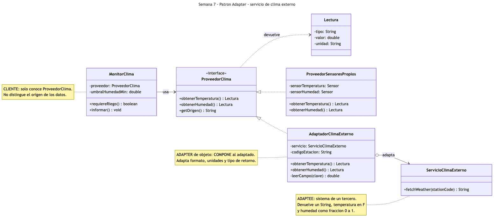
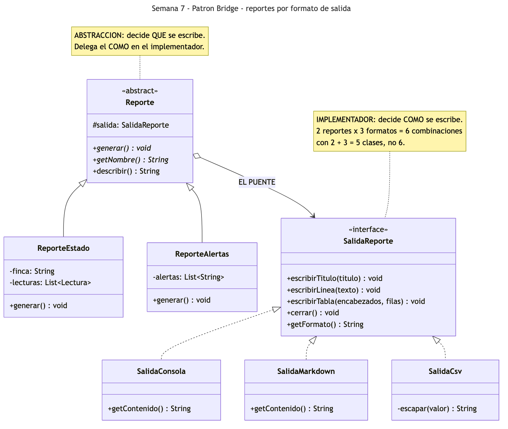
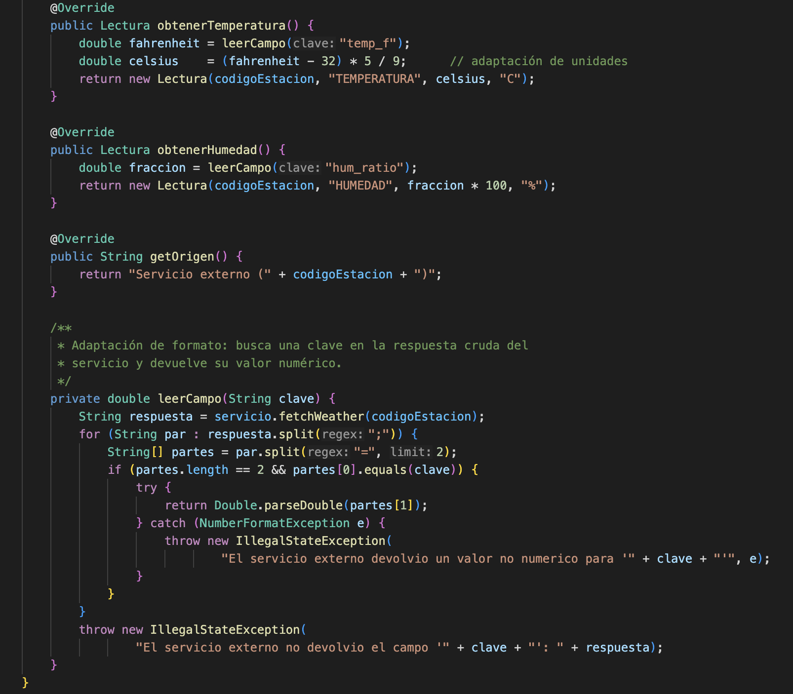
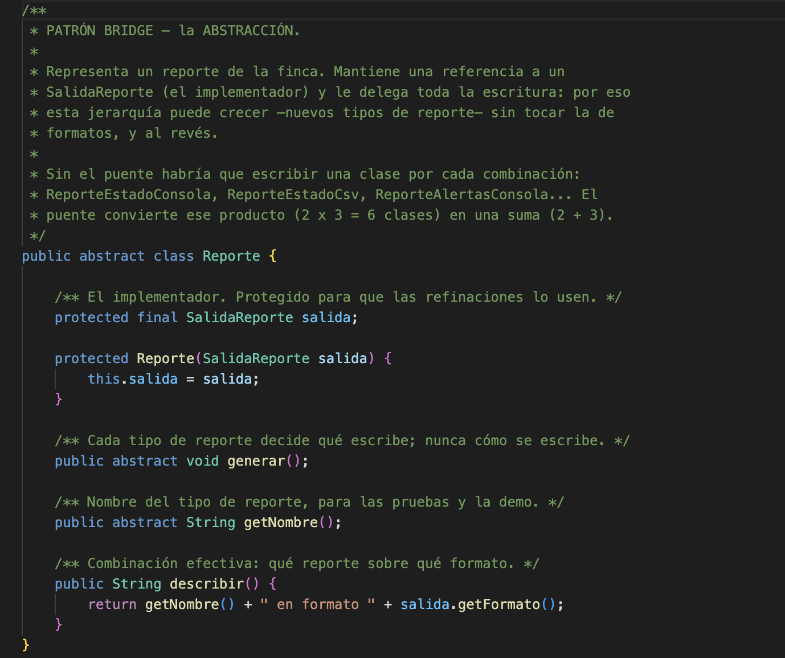
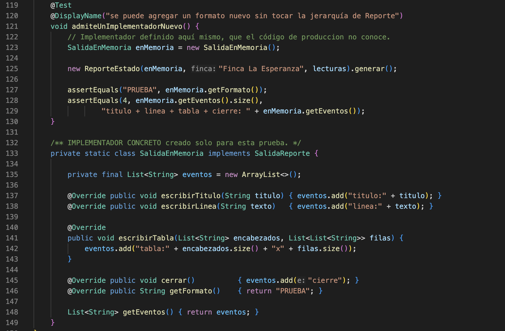
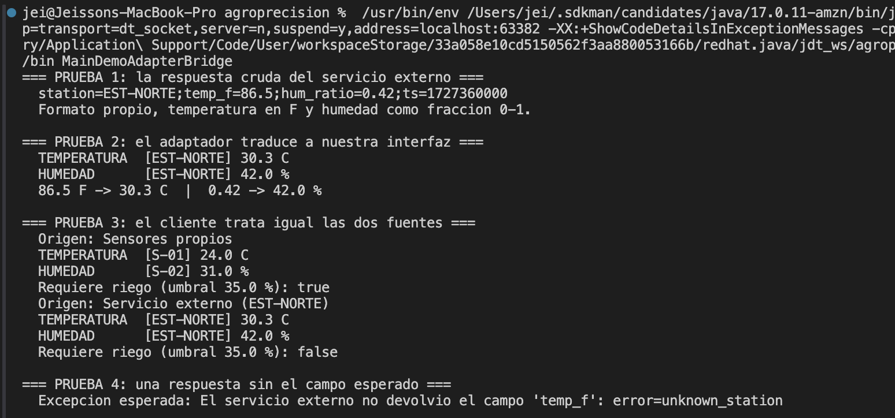
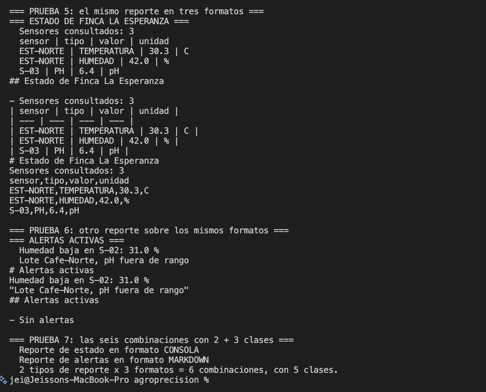
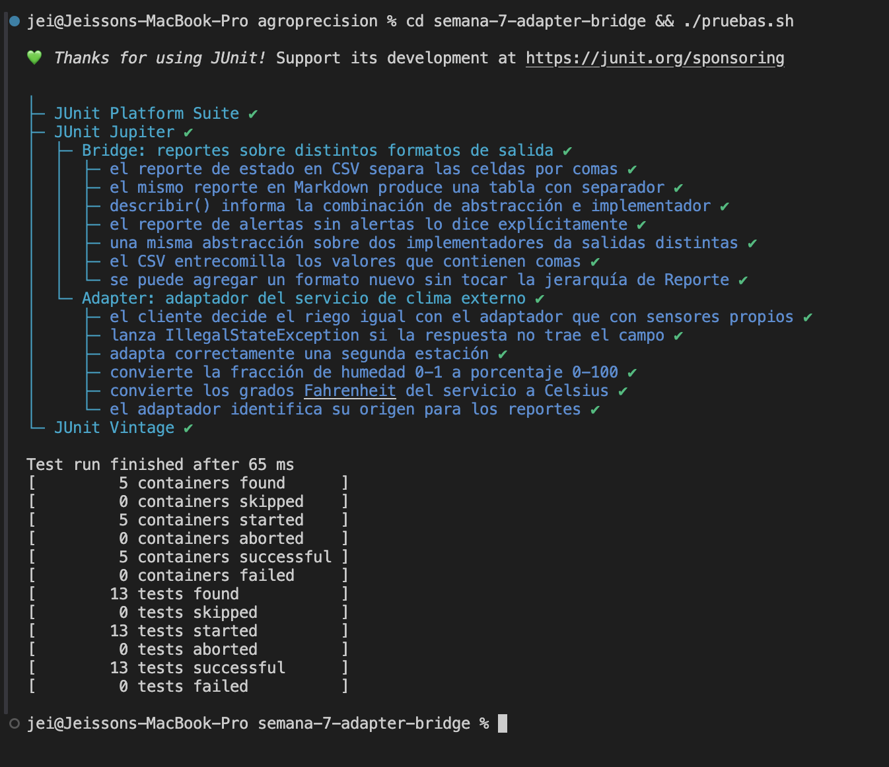

# Semana 7 — Patrones Adapter y Bridge

Aplicación de dos patrones estructurales en el prototipo **AgroPrecisión**. **Adapter** integra un
servicio meteorológico de un tercero, cuya interfaz no encaja con la nuestra, sin tocar el código
que consume los datos. **Bridge** separa *qué* se reporta de *cómo* se escribe, de modo que los
tipos de reporte y los formatos de salida puedan crecer por separado.

**Estudiantes:** Jeisson Stewen Berdugo Cely · Darwin Felipe Gil López
**Grupo:** E-195

**Código Adapter:** [`ProveedorClima.java`](src/ProveedorClima.java) (interfaz objetivo) ·
[`ServicioClimaExterno.java`](src/ServicioClimaExterno.java) (adaptado) ·
[`AdaptadorClimaExterno.java`](src/AdaptadorClimaExterno.java) (adaptador) ·
[`ProveedorSensoresPropios.java`](src/ProveedorSensoresPropios.java) · [`MonitorClima.java`](src/MonitorClima.java) (cliente)

**Código Bridge:** [`Reporte.java`](src/Reporte.java) (abstracción) ·
[`ReporteEstado.java`](src/ReporteEstado.java) · [`ReporteAlertas.java`](src/ReporteAlertas.java) (refinadas) ·
[`SalidaReporte.java`](src/SalidaReporte.java) (implementador) ·
[`SalidaConsola.java`](src/SalidaConsola.java) · [`SalidaMarkdown.java`](src/SalidaMarkdown.java) · [`SalidaCsv.java`](src/SalidaCsv.java)

**Demo:** [`MainDemoAdapterBridge.java`](src/MainDemoAdapterBridge.java) ·
**Pruebas:** [`AdaptadorClimaExternoTest.java`](test/AdaptadorClimaExternoTest.java) · [`ReporteBridgeTest.java`](test/ReporteBridgeTest.java)

**Para ejecutar la demo:**

```bash
cd semana-7-adapter-bridge/src && javac *.java && java MainDemoAdapterBridge
```

**Para ejecutar las pruebas unitarias:**

```bash
cd semana-7-adapter-bridge && ./pruebas.sh
```

Las clases `Sensor` y `Lectura` están copiadas de la Semana 4 para que esta carpeta compile por sí
sola. No se modificó nada de su contenido.

---

## Parte 1 — Adapter: servicio de clima externo

### El problema

La finca contrata un servicio meteorológico externo para complementar sus sensores. Ese servicio
ya existe, lo mantiene un tercero y **no podemos cambiarlo**. Su interfaz no se parece en nada a
la nuestra:

```java
servicio.fetchWeather("EST-NORTE");
// -> "station=EST-NORTE;temp_f=86.5;hum_ratio=0.42;ts=1727360000"
```

Hay tres incompatibilidades a la vez: devuelve un `String` con pares `clave=valor` en vez de un
objeto, la temperatura viene en **grados Fahrenheit** y la humedad como **fracción de 0 a 1** en
lugar de porcentaje.

Sin patrón, cada módulo que quiera usar el servicio tendría que parsear la cadena y convertir las
unidades por su cuenta. Ese código se repetiría en riego, en reportes y en predicción; peor aún,
el módulo de riego quedaría acoplado a una clase de un tercero, y el día que el proveedor cambie
el formato habría que corregir los tres sitios.

### Qué es el Adapter

Es un patrón estructural. Su intención, según el GoF, es convertir la interfaz de una clase en
otra que el cliente espera, permitiendo que colaboren clases que de otro modo no podrían por
tener interfaces incompatibles. Sus roles son el **target** (la interfaz que el cliente espera),
el **adaptee** (la clase existente con la interfaz incompatible), el **adapter** (que traduce
entre ambas) y el **cliente**.

Tiene dos variantes: el *adapter de clase*, que hereda del adaptado, y el *adapter de objeto*,
que lo compone.

### Cómo lo aplicamos

| Rol en el patrón | Clases |
|---|---|
| Target | [`ProveedorClima.java`](src/ProveedorClima.java) — `obtenerTemperatura()`, `obtenerHumedad()`, ambos devuelven `Lectura` |
| Adaptee | [`ServicioClimaExterno.java`](src/ServicioClimaExterno.java) — `fetchWeather(String)` devuelve un `String` |
| Adapter | [`AdaptadorClimaExterno.java`](src/AdaptadorClimaExterno.java) |
| Implementación nativa | [`ProveedorSensoresPropios.java`](src/ProveedorSensoresPropios.java) — usa los sensores de la finca |
| Cliente | [`MonitorClima.java`](src/MonitorClima.java) — decide el riego, solo conoce `ProveedorClima` |

El adaptador hace **tres adaptaciones simultáneas**, y conviene señalarlas por separado porque es
lo que distingue a este caso de una simple conversión de unidades:

1. **De formato**: `leerCampo()` parsea la respuesta `clave=valor;clave=valor`.
2. **De unidades**: `(fahrenheit - 32) * 5 / 9` y `fraccion * 100`.
3. **De tipo**: devuelve `Lectura`, el mismo objeto que producen los sensores propios.

Usamos la variante de **objeto** —el adaptador guarda una referencia al servicio— y no la de
clase. Dos razones: Java no admite herencia múltiple, así que heredar de `ServicioClimaExterno`
impediría heredar de cualquier otra cosa; y atarse por herencia a una clase de un tercero es
frágil, porque cualquier cambio en ella se propaga a nuestra jerarquía.

La prueba de que el patrón cumple su función está en `MonitorClima`: recibe un `ProveedorClima` y
decide si regar. Le da exactamente igual que detrás haya un sensor instalado en el lote o una API
meteorológica; **no tiene una sola línea que distinga el origen**.

### Diagrama UML del Adapter



`AdaptadorClimaExterno` implementa `ProveedorClima` (línea punteada con triángulo: realización) y
al mismo tiempo **compone** a `ServicioClimaExterno` (rombo: agregación). Esa doble relación es la
firma visual del adapter de objeto. `MonitorClima` apunta solo a la interfaz, nunca al servicio
externo.

Fuente del diagrama: [`diagramas/uml-adapter.mmd`](diagramas/uml-adapter.mmd).

---

## Parte 2 — Bridge: reportes por formato de salida

### El problema

El sistema necesita dos tipos de reporte —el estado de los lotes y las alertas activas— y cada uno
debe poder emitirse en tres formatos: texto de consola para el operario, Markdown para pegar en el
informe y CSV para abrir en una hoja de cálculo.

Resuelto por herencia, eso son seis clases: `ReporteEstadoConsola`, `ReporteEstadoMarkdown`,
`ReporteEstadoCsv`, `ReporteAlertasConsola`… El problema no es el número, es cómo crece: al
agregar un tipo de reporte hay que escribir tres clases nuevas, y al agregar un formato, dos. Es
una **explosión combinatoria**, y además el código de formato queda duplicado entre las clases de
cada columna.

### Qué es el Bridge

Es un patrón estructural. Su intención, según el GoF, es desacoplar una abstracción de su
implementación para que ambas puedan variar de forma independiente. Sus roles son la
**abstracción**, que define la interfaz de alto nivel y guarda una referencia al implementador;
las **abstracciones refinadas**, que la extienden; el **implementador**, que declara las
operaciones primitivas; y los **implementadores concretos**.

La clave es que la relación entre abstracción e implementador es de **composición, no de
herencia**: ese enlace es el "puente" que da nombre al patrón, y es lo que convierte un producto
(2 × 3 = 6 clases) en una suma (2 + 3 = 5).

### Cómo lo aplicamos

| Rol en el patrón | Clases |
|---|---|
| Abstracción | [`Reporte.java`](src/Reporte.java) — guarda el `SalidaReporte` y declara `generar()` |
| Abstracciones refinadas | [`ReporteEstado.java`](src/ReporteEstado.java) · [`ReporteAlertas.java`](src/ReporteAlertas.java) |
| Implementador | [`SalidaReporte.java`](src/SalidaReporte.java) — `escribirTitulo()`, `escribirLinea()`, `escribirTabla()`, `cerrar()` |
| Implementadores concretos | [`SalidaConsola.java`](src/SalidaConsola.java) · [`SalidaMarkdown.java`](src/SalidaMarkdown.java) · [`SalidaCsv.java`](src/SalidaCsv.java) |

El reparto de responsabilidades es estricto y es lo que hay que sustentar: `ReporteEstado` sabe
que un reporte de estado lleva un título, una línea de contexto y una tabla de lecturas —eso es el
**qué**—, pero no sabe si la tabla se pintará con `|` o con comas. `SalidaCsv` sabe escribir una
tabla en CSV y entrecomillar los valores que traen comas —eso es el **cómo**—, pero no sabe qué
datos contiene.

Hay una relación directa con la **Semana 5**: allí aplicamos Builder al mismo módulo de reportes,
y conviene no confundirlos. **Builder resuelve la construcción** de un reporte con partes
opcionales; **Bridge resuelve la variación en dos ejes** independientes. Son complementarios: un
builder podría armar el contenido que luego una abstracción `Reporte` manda escribir por el
implementador que corresponda.

### Diagrama UML del Bridge



Se ven las dos jerarquías separadas y el rombo que las une, rotulado **EL PUENTE**: es la única
relación entre ellas, y va de la abstracción al implementador, nunca al revés. Por eso agregar
`SalidaJson` no obliga a tocar `Reporte` ni sus refinaciones, y agregar `ReporteInventario` no
obliga a tocar ningún formato.

Fuente del diagrama: [`diagramas/uml-bridge.mmd`](diagramas/uml-bridge.mmd).

---

## Pruebas unitarias

Esta semana el proyecto incorpora **JUnit 5**, en la forma más simple posible: un único jar
autónomo en [`lib/`](../lib/) —en la raíz del repositorio—, sin Maven ni Gradle. Se ejecutan con:

```bash
cd semana-7-adapter-bridge && ./pruebas.sh
```

El script compila `src/` y `test/` y lanza el *console launcher* de JUnit.

El jar está en la raíz y no dentro de esta carpeta por una razón práctica: cuando el proyecto no
usa Maven ni Gradle, la extensión de Java de VS Code busca las librerías externas en `lib/**/*.jar`
desde la raíz del workspace. Si el jar se guarda dentro de la semana, el editor no lo encuentra y
marca errores falsos (`assertEquals is undefined`) aunque las pruebas compilen y pasen en la
terminal.

Un detalle de diseño que las pruebas hicieron evidente: **los sensores de las semanas anteriores
generan valores aleatorios, así que no se pueden usar en una prueba con resultado esperado**. Por
eso existe [`SensorFijo.java`](src/SensorFijo.java), un *stub* que devuelve siempre el mismo valor.
Poder sustituirlo es consecuencia directa de que el sistema programe contra la interfaz `Sensor` y
no contra clases concretas: el propio diseño con patrones es lo que hace el código testeable.

### Qué verifica cada prueba

| Clase de prueba | Caso | Qué comprueba |
|---|---|---|
| `AdaptadorClimaExternoTest` | `convierteFahrenheitACelsius` | 86.5 °F → 30.28 °C, unidad `C` |
| | `convierteFraccionAPorcentaje` | 0.42 → 42.0, unidad `%` |
| | `adaptaOtraEstacion` | 71.6 °F → 22.0 °C y 0.305 → 30.5 % |
| | `fallaConRespuestaIncompleta` | `IllegalStateException` nombrando el campo ausente |
| | `elClienteNoDistingueElOrigen` | El mismo `MonitorClima` decide bien con ambas fuentes |
| | `informaSuOrigen` | El adaptador se identifica en los reportes |
| `ReporteBridgeTest` | `reporteEstadoEnCsv` | Cabecera y filas separadas por comas |
| | `reporteEstadoEnMarkdown` | Tabla Markdown con fila separadora |
| | `csvEscapaLasComas` | Un valor con coma queda entrecomillado |
| | `reporteAlertasVacio` | Sin alertas se escribe `Sin alertas` |
| | `mismaAbstraccionDistintoFormato` | Dos formatos, texto distinto, mismos datos |
| | `describeLaCombinacion` | `describir()` informa abstracción + implementador |
| | `admiteUnImplementadorNuevo` | Un formato definido en la propia prueba funciona **sin tocar** `Reporte` |

La última es la más importante para sustentar el Bridge: la prueba define su propio
`SalidaEnMemoria`, una clase que el código de producción no conoce, y `ReporteEstado` funciona con
ella sin ninguna modificación. Eso es, en ejecución, la independencia entre las dos jerarquías.

---

## Evidencias

Estas son las pruebas que ejecutamos para comprobar que los dos patrones funcionan como
esperábamos. Las tres primeras capturas corresponden al código y las tres últimas a las
ejecuciones. La numeración continúa la de las semanas anteriores.

Todo se ejecutó en VS Code sobre Java 17, con el botón *Run* de la extensión de Java.

| Captura | Qué muestra |
|---|---|
| [25](#captura-25) | `AdaptadorClimaExterno`: las tres adaptaciones |
| [26](#captura-26) | La abstracción `Reporte` con el puente al implementador |
| [27](#captura-27) | `SalidaReporte` y el implementador nuevo definido en la prueba |
| [28](#captura-28) | Demo, pruebas 1 a 4: el Adapter |
| [29](#captura-29) | Demo, pruebas 5 a 7: el Bridge |
| [30](#captura-30) | Las 13 pruebas unitarias en verde |

---

<a id="captura-25"></a>
### Captura 25 — El adaptador



**Archivo:** `src/AdaptadorClimaExterno.java` · **Líneas:** 27 a 64

`obtenerTemperatura()` y `obtenerHumedad()` hacen la conversión de unidades; `leerCampo()` hace la
de formato, parseando la respuesta cruda del servicio. El campo `servicio` es la composición del
adaptado que caracteriza al adapter de objeto.

<a id="captura-26"></a>
### Captura 26 — La abstracción del Bridge



**Archivo:** `src/Reporte.java` · **Líneas:** 13 a 32

El campo `protected final SalidaReporte salida` **es el puente**. `generar()` es abstracto: cada
reporte decide su contenido. Ninguna línea de esta clase menciona consola, Markdown ni CSV.

<a id="captura-27"></a>
### Captura 27 — Un implementador nuevo, creado en la prueba



**Archivo:** `test/ReporteBridgeTest.java` · **Líneas:** 119 a 149

La prueba define `SalidaEnMemoria`, un formato que el código de producción desconoce, y lo usa con
`ReporteEstado` sin modificar nada. Es la evidencia ejecutable de que las dos jerarquías varían
por separado.

<a id="captura-28"></a>
### Captura 28 — Demo, el Adapter



**Terminal:** salida de `java MainDemoAdapterBridge`, pruebas 1 a 4.

Se ve la respuesta cruda del servicio, su traducción a `Lectura` en °C y %, y el mismo
`MonitorClima` operando con las dos fuentes. La prueba 4 muestra el error controlado cuando la
respuesta no trae el campo esperado.

<a id="captura-29"></a>
### Captura 29 — Demo, el Bridge



**Terminal:** salida de `java MainDemoAdapterBridge`, pruebas 5 a 7.

El mismo `ReporteEstado` sale en tres formatos, y `ReporteAlertas` usa esos mismos formatos. Nótese
el entrecomillado del CSV en la alerta que contiene una coma.

<a id="captura-30"></a>
### Captura 30 — Las pruebas unitarias



**Terminal:** salida de `./pruebas.sh`.

Trece pruebas, ninguna fallida. El árbol muestra los nombres en español gracias a `@DisplayName`.

---

## Resultados

| # | Prueba | Patrón | Resultado esperado | Resultado obtenido | Estado | Captura |
|---|---|---|---|---|---|---|
| 1 | Respuesta cruda del servicio | Adapter | `String` con `temp_f` y `hum_ratio` | `station=EST-NORTE;temp_f=86.5;hum_ratio=0.42;ts=1727360000` | ✅ OK | 28 |
| 2 | Traducción del adaptador | Adapter | 86.5 °F → 30.3 °C; 0.42 → 42.0 % | `TEMPERATURA [EST-NORTE] 30.3 C` · `HUMEDAD [EST-NORTE] 42.0 %` | ✅ OK | 28 |
| 3 | Cliente indiferente al origen | Adapter | Propios: riega · Externo: no riega | `31.0 %` → `true` · `42.0 %` → `false`, mismo `MonitorClima` | ✅ OK | 28 |
| 4 | Respuesta sin el campo | Adapter | `IllegalStateException` nombrando `temp_f` | `no devolvio el campo 'temp_f': error=unknown_station` | ✅ OK | 28 |
| 5 | Un reporte, tres formatos | Bridge | Consola, Markdown y CSV con los mismos datos | Las tres salidas con las mismas 3 lecturas; CSV `EST-NORTE,TEMPERATURA,30.3,C` | ✅ OK | 29 |
| 6 | Otro reporte, mismos formatos | Bridge | Alertas en consola y CSV; vacío en Markdown | CSV entrecomilla `"Lote Cafe-Norte, pH fuera de rango"`; vacío imprime `Sin alertas` | ✅ OK | 29 |
| 7 | Combinaciones | Bridge | 2 × 3 combinaciones con 5 clases | `Reporte de estado en formato CONSOLA` · `Reporte de alertas en formato MARKDOWN` | ✅ OK | 29 |
| 8 | Pruebas unitarias | Ambos | 13 pruebas exitosas, 0 fallidas | `13 tests successful`, `0 tests failed`, en 65 ms | ✅ OK | 30 |
